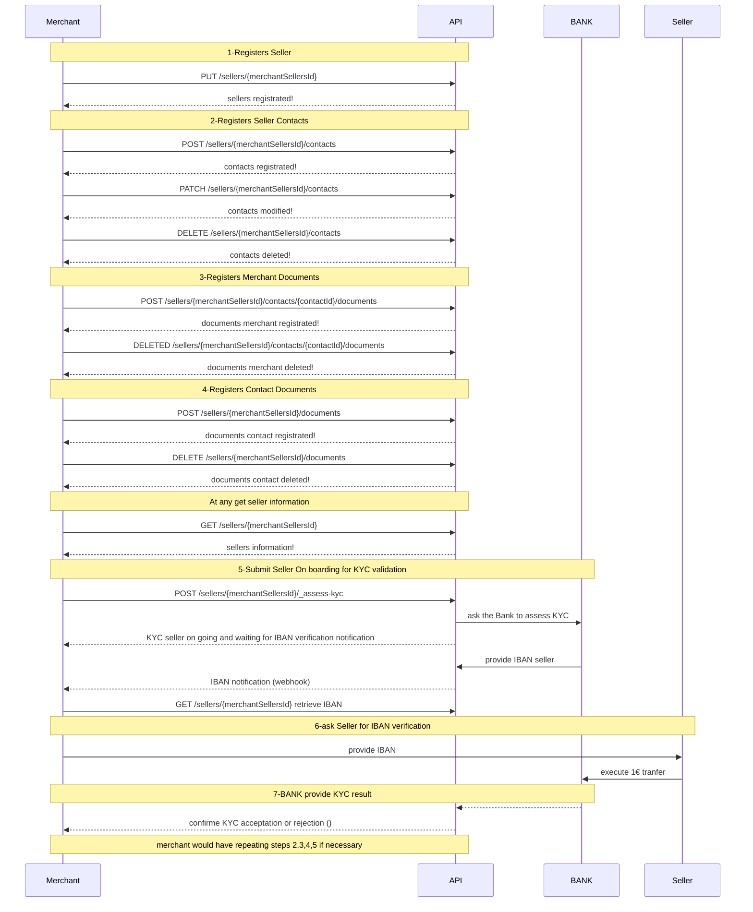
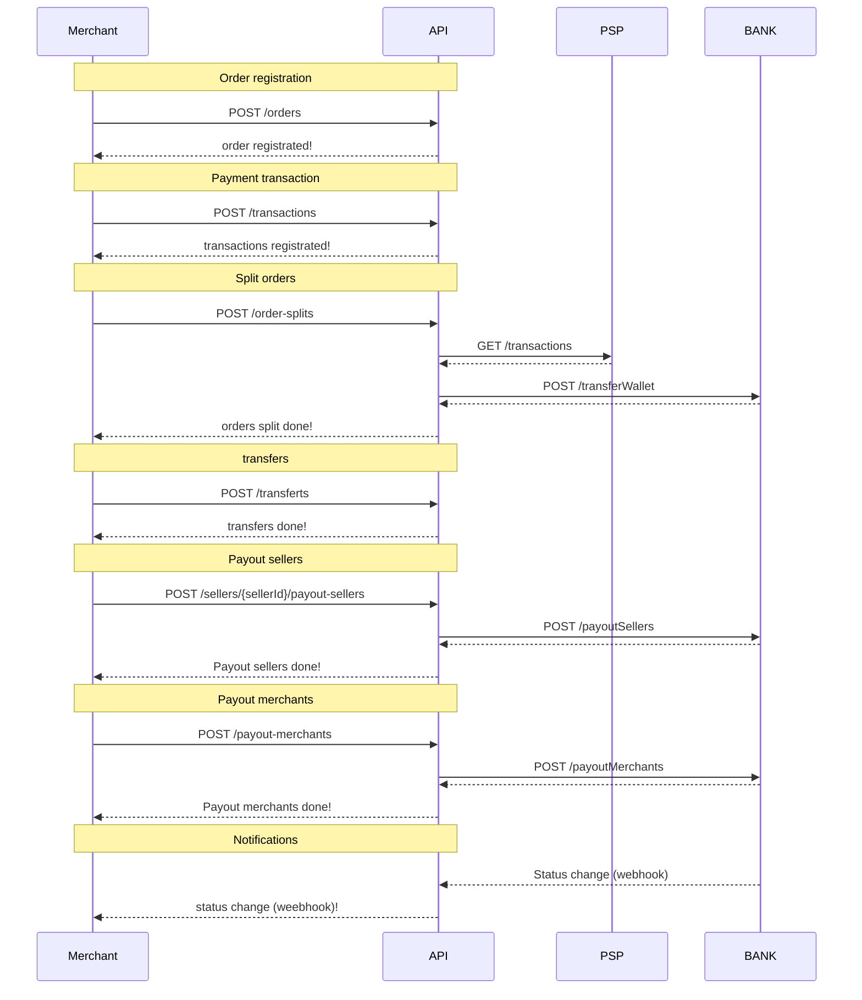

# UAT API for partners

## 1 - Sellers on boarding

### Description

Sellers on boarding is 7 steps completion:

1. Merchant registers sellers&#x20;
2. Merchant registers all sellers contacts
3. Merchant registers all merchant documents
4. Merchant registers all contacts documents
5. Merchant submit a seller for KYC validation when all information required is complete.
6. Merchant ask seller for IBAN verification
7. Bank will provide KYC result (OK, KO, INCOMPLETE)

### API sequence diagram

### Sellers Onboarding


[swagger_marketplace_1.0.18.yaml](../../.gitbook/assets/swagger_marketplace_1.0.18.yaml)



[swagger_marketplace_1.0.18.yaml](../../.gitbook/assets/swagger_marketplace_1.0.18.yaml)


### Contacts


[swagger_marketplace_1.0.18.yaml](../../.gitbook/assets/swagger_marketplace_1.0.18.yaml)



[swagger_marketplace_1.0.18.yaml](../../.gitbook/assets/swagger_marketplace_1.0.18.yaml)



[swagger_marketplace_1.0.18.yaml](../../.gitbook/assets/swagger_marketplace_1.0.18.yaml)


### Documents


[swagger_marketplace_1.0.18.yaml](../../.gitbook/assets/swagger_marketplace_1.0.18.yaml)



[swagger_marketplace_1.0.18.yaml](../../.gitbook/assets/swagger_marketplace_1.0.18.yaml)



[swagger_marketplace_1.0.18.yaml](../../.gitbook/assets/swagger_marketplace_1.0.18.yaml)



[swagger_marketplace_1.0.18.yaml](../../.gitbook/assets/swagger_marketplace_1.0.18.yaml)


### Sellers


[swagger_marketplace_1.0.18.yaml](../../.gitbook/assets/swagger_marketplace_1.0.18.yaml)


## 2- Cash management

### **Description**

* The Marketplace Services API is used to execute the payment process from order until the payout.
* It offers the ability to register orders, transactions and then apply order-splits, transfers and payouts.
* Once the order is registered, the marketplace associates the transactions with the order. Then, the marketplace allocates funds to each seller and charges fees through the order-splits endpoint.
* Finally, the marketplace can make payments to the seller's external account or to its own external account.
* The endpoint /transfers provides the ability for the Marketplace to move funds between the seller account and the Marketplace account or vice versa.

### API sequence diagram

## Orders


[swagger_marketplace_1.0.18.yaml](../../.gitbook/assets/swagger_marketplace_1.0.18.yaml)



[swagger_marketplace_1.0.18.yaml](../../.gitbook/assets/swagger_marketplace_1.0.18.yaml)



[swagger_marketplace_1.0.18.yaml](../../.gitbook/assets/swagger_marketplace_1.0.18.yaml)



[swagger_marketplace_1.0.18.yaml](../../.gitbook/assets/swagger_marketplace_1.0.18.yaml)


### OrderSplits


[swagger_marketplace_1.0.18.yaml](../../.gitbook/assets/swagger_marketplace_1.0.18.yaml)


### Transactions


[swagger_marketplace_1.0.18.yaml](../../.gitbook/assets/swagger_marketplace_1.0.18.yaml)



[swagger_marketplace_1.0.18.yaml](../../.gitbook/assets/swagger_marketplace_1.0.18.yaml)



[swagger_marketplace_1.0.18.yaml](../../.gitbook/assets/swagger_marketplace_1.0.18.yaml)



[swagger_marketplace_1.0.18.yaml](../../.gitbook/assets/swagger_marketplace_1.0.18.yaml)



[swagger_marketplace_1.0.18.yaml](../../.gitbook/assets/swagger_marketplace_1.0.18.yaml)


### Transferts


[swagger_marketplace_1.0.18.yaml](../../.gitbook/assets/swagger_marketplace_1.0.18.yaml)



[swagger_marketplace_1.0.18.yaml](../../.gitbook/assets/swagger_marketplace_1.0.18.yaml)



[swagger_marketplace_1.0.18.yaml](../../.gitbook/assets/swagger_marketplace_1.0.18.yaml)



[swagger_marketplace_1.0.18.yaml](../../.gitbook/assets/swagger_marketplace_1.0.18.yaml)


### PayoutMerchants


[swagger_marketplace_1.0.18.yaml](../../.gitbook/assets/swagger_marketplace_1.0.18.yaml)



[swagger_marketplace_1.0.18.yaml](../../.gitbook/assets/swagger_marketplace_1.0.18.yaml)



[swagger_marketplace_1.0.18.yaml](../../.gitbook/assets/swagger_marketplace_1.0.18.yaml)



[swagger_marketplace_1.0.18.yaml](../../.gitbook/assets/swagger_marketplace_1.0.18.yaml)


### PayoutSellers


[swagger_marketplace_1.0.18.yaml](../../.gitbook/assets/swagger_marketplace_1.0.18.yaml)



[swagger_marketplace_1.0.18.yaml](../../.gitbook/assets/swagger_marketplace_1.0.18.yaml)



[swagger_marketplace_1.0.18.yaml](../../.gitbook/assets/swagger_marketplace_1.0.18.yaml)



[swagger_marketplace_1.0.18.yaml](../../.gitbook/assets/swagger_marketplace_1.0.18.yaml)


### PayoutSellerAmounts


[swagger_marketplace_1.0.18.yaml](../../.gitbook/assets/swagger_marketplace_1.0.18.yaml)



[swagger_marketplace_1.0.18.yaml](../../.gitbook/assets/swagger_marketplace_1.0.18.yaml)



[swagger_marketplace_1.0.18.yaml](../../.gitbook/assets/swagger_marketplace_1.0.18.yaml)



[swagger_marketplace_1.0.18.yaml](../../.gitbook/assets/swagger_marketplace_1.0.18.yaml)


### Accounts


[swagger_marketplace_1.0.18.yaml](../../.gitbook/assets/swagger_marketplace_1.0.18.yaml)



[swagger_marketplace_1.0.18.yaml](../../.gitbook/assets/swagger_marketplace_1.0.18.yaml)


Download OpenAPI specs:


YAML marketplace services for UAT

