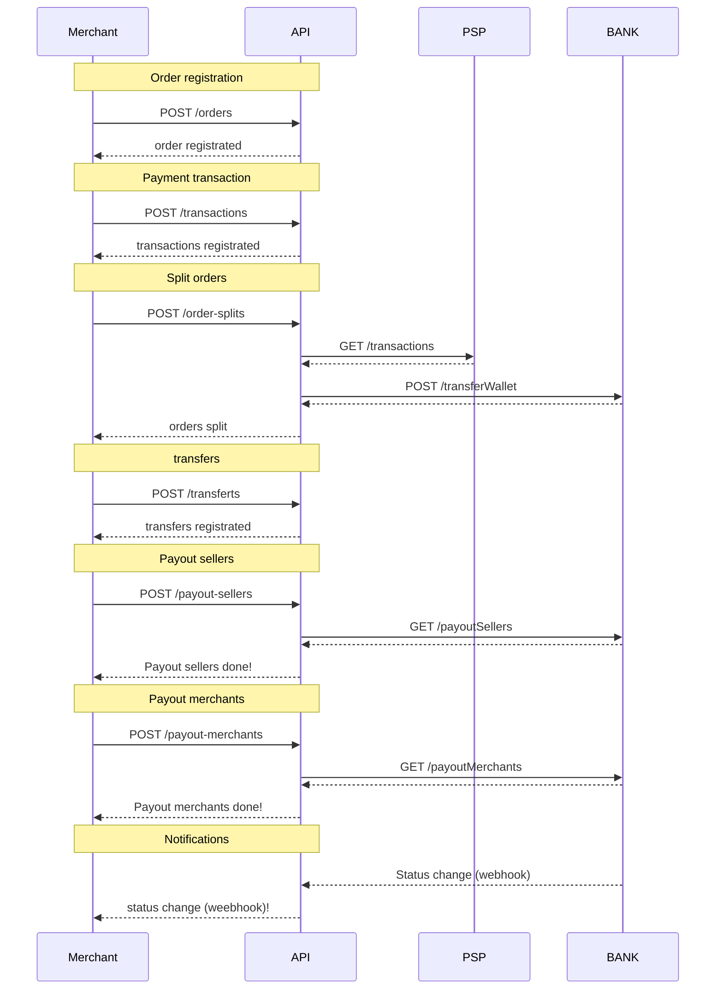

# UAT API for partners

### Description

**Marketplace Services**

* The Marketplace Services API is used to execute the payment process from order until the payout.
* It offers the ability to register orders, transactions and then apply order-splits, transfers and payouts.
* Once the order is registered, the marketplace associates the transactions with the order. Then, the marketplace allocates funds to each seller and charges fees through the order-splits endpoint.
* Finally, the marketplace can make payments to the seller's external account or to its own external account.
* The endpoint /transfers provides the ability for the Marketplace to move funds between the seller account and the Marketplace account or vice versa.

### API sequence diagram

### Orders


[swagger_marketplace_1.0.6_UAT.yaml](../../.gitbook/assets/swagger_marketplace_1.0.6_UAT.yaml)



[swagger_marketplace_1.0.6_UAT.yaml](../../.gitbook/assets/swagger_marketplace_1.0.6_UAT.yaml)


### Transactions


[swagger_marketplace_1.0.6_UAT.yaml](../../.gitbook/assets/swagger_marketplace_1.0.6_UAT.yaml)



[swagger_marketplace_1.0.6_UAT.yaml](../../.gitbook/assets/swagger_marketplace_1.0.6_UAT.yaml)



[swagger_marketplace_1.0.6_UAT.yaml](../../.gitbook/assets/swagger_marketplace_1.0.6_UAT.yaml)


### OrderSplits


[swagger_marketplace_1.0.6_UAT.yaml](../../.gitbook/assets/swagger_marketplace_1.0.6_UAT.yaml)


### Transferts


[swagger_marketplace_1.0.6_UAT.yaml](../../.gitbook/assets/swagger_marketplace_1.0.6_UAT.yaml)



[swagger_marketplace_1.0.6_UAT.yaml](../../.gitbook/assets/swagger_marketplace_1.0.6_UAT.yaml)



[swagger_marketplace_1.0.6_UAT.yaml](../../.gitbook/assets/swagger_marketplace_1.0.6_UAT.yaml)



[swagger_marketplace_1.0.6_UAT.yaml](../../.gitbook/assets/swagger_marketplace_1.0.6_UAT.yaml)


### PayoutMerchants


[swagger_marketplace_1.0.6_UAT.yaml](../../.gitbook/assets/swagger_marketplace_1.0.6_UAT.yaml)



[swagger_marketplace_1.0.6_UAT.yaml](../../.gitbook/assets/swagger_marketplace_1.0.6_UAT.yaml)



[swagger_marketplace_1.0.6_UAT.yaml](../../.gitbook/assets/swagger_marketplace_1.0.6_UAT.yaml)



[swagger_marketplace_1.0.6_UAT.yaml](../../.gitbook/assets/swagger_marketplace_1.0.6_UAT.yaml)


### PayoutSellers


[swagger_marketplace_1.0.6_UAT.yaml](../../.gitbook/assets/swagger_marketplace_1.0.6_UAT.yaml)



[swagger_marketplace_1.0.6_UAT.yaml](../../.gitbook/assets/swagger_marketplace_1.0.6_UAT.yaml)



[swagger_marketplace_1.0.6_UAT.yaml](../../.gitbook/assets/swagger_marketplace_1.0.6_UAT.yaml)



[swagger_marketplace_1.0.6_UAT.yaml](../../.gitbook/assets/swagger_marketplace_1.0.6_UAT.yaml)


### PayoutSellerAmounts


[swagger_marketplace_1.0.6_UAT.yaml](../../.gitbook/assets/swagger_marketplace_1.0.6_UAT.yaml)



[swagger_marketplace_1.0.6_UAT.yaml](../../.gitbook/assets/swagger_marketplace_1.0.6_UAT.yaml)



[swagger_marketplace_1.0.6_UAT.yaml](../../.gitbook/assets/swagger_marketplace_1.0.6_UAT.yaml)



[swagger_marketplace_1.0.6_UAT.yaml](../../.gitbook/assets/swagger_marketplace_1.0.6_UAT.yaml)


### Accounts


[swagger_marketplace_1.0.6_UAT.yaml](../../.gitbook/assets/swagger_marketplace_1.0.6_UAT.yaml)



[swagger_marketplace_1.0.6_UAT.yaml](../../.gitbook/assets/swagger_marketplace_1.0.6_UAT.yaml)


Download OpenAPI specs:


YAML marketplace services for UAT

