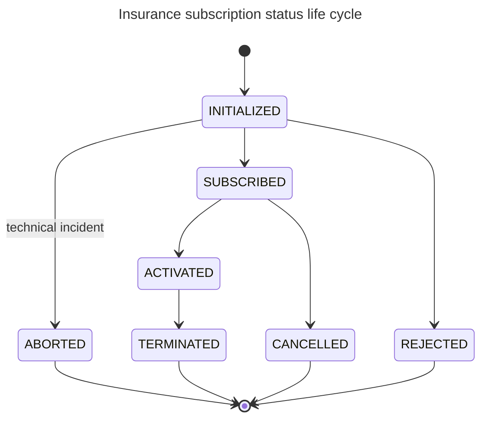

# Insurance Status life cycle

### Statuses  definition:

* INITIALIZED: subscription has been initialized by insurance institution
* SUBSCRIBED: subscription accepted by insurance institution
* ACTIVATED: subscription activated at starting condition ( ex: manufacturer's warranty ended)
* TERMINATED; subscription terminated at ending condition&#x20;
* REJECTED: subscription rejected by financial institution
* ABORTED: subscription has been aborted due to technical incident
* CANCELLED: subscription cancelled by financial institution&#x20;

### Status life cycle:

