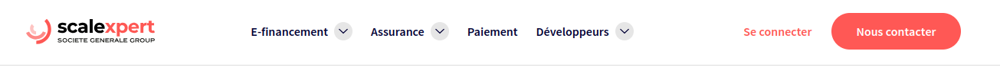

# Snippet front guide

## Presentation <a href="#id-1.-presentation" id="id-1.-presentation"></a>

<figure><figcaption></figcaption></figure>

Example implementation code to display the data returned from the Scalexpert API after formatting.&#x20;

Languages ​​used: HTML, CSS, vanilla JS. Using HTML5 templates&#x20;

To implement this example, you need to call/include the templates, assets (css and js) in the page where you want to display the insert.

## Installation <a href="#id-2.-installation" id="id-2.-installation"></a>

You need to include the file or file content `scalexpert-template.html`in the desired page.\
If you want, you can move the calls of the different assets to integrate it into your solution ( `scalexpert.js`and `scalexpert.css`).


Two implementation methods are possible:

* with data transformation from the back (this method allow you to customize content of  the widget but require more complexity to implement)
* with data returned from the raw scalexpert API (the easiest way to implement)


## A-Implementation method with data “formatted” by your solution <a href="#id-3.-configuration" id="id-3.-configuration"></a>

### Configuration <a href="#id-3.-configuration" id="id-3.-configuration"></a>

#### 1. Once all the necessary elements (template, css and js) are on your page, you need to create a hook point in your page to display your insert. <a href="#id-1.-une-fois-tous-les-elements-necessaires-template-css-et-js-sur-votre-page-il-vous-faut-creer-un-po" id="id-1.-une-fois-tous-les-elements-necessaires-template-css-et-js-sur-votre-page-il-vous-faut-creer-un-po"></a>

For example


```html
<div class="scalexpert-example"></div>
```


#### 2. Call the component creation in JavaScript <a href="#id-2.-appeler-en-javascript-la-creation-du-composant" id="id-2.-appeler-en-javascript-la-creation-du-composant"></a>

<pre class="language-javascript" data-overflow="wrap" data-line-numbers><code class="lang-javascript"><strong>&#x3C;script type="application/javascript"> 
</strong><strong>    (document.addEventListener("DOMContentLoaded", () => { 
</strong>        let Snippet = new Scalexpert(); 
    } )); 
&#x3C;/script>
</code></pre>

#### 3. Configuration / paramètres <a href="#id-3.-configuration-parametres" id="id-3.-configuration-parametres"></a>

Adding the component “settings”, here the “anchor” (JavaScript selector), where the component should be displayed:


```javascript
Snippet.setSettings({ 
    anchor: '.scalexpert-example' 
});
```


You also need to pass in parameters ([FRONT Documentation | 6. Configuration Variables Details](snippet-front-guide.md#id-6.-details-des-variables-de-configuration)) the various previously formatted elements coming from the Scalexpert API (Documentation BACK ), everything will be passed into a table "`simulations"`containing the objects of the different simulations, for example:


```json
simulations: [
    {
        title: 'Payez en 3 fois sans frais avec votre carte bancaire',
        shortDescriptionLegal: '',
        informationIconUrl: 'https://scalexpert.hml.societegenerale.com/sites/default/files/2024-02/visual_information_icon.svg',
        logoUrl: 'https://scalexpert.hml.societegenerale.com/sites/default/files/2024-02/e_financing_visual_logo_FR.svg',
        displayLogo: true,
        duration: 3,
        additionalInformation: "<p>Le paiement en 3 fois par carte bancaire est une solution de paiement qui vous permet d'échelonner le règlement de votre commande en 3 mensualités débitées sur le compte associé à votre carte bancaire.<br> Exemple : pour un achat de 600 € payé en 3 fois, vous réglez 3 échéances de 200€. Montant du financement : 600 €. TAEG FIXE: 0%. Taux débiteur fixe : 0%. Frais:0€. Montant total dû : 600€. Le prélèvement des échéances s'étale sur une durée de 90 jours maximum à compter de la date d'achat*.</p><div class='scalexpert_subtitle'>Comment ça marche ?</div><ol> <li>Ajoutez le produit à votre panier, finalisez votre achat puis validez votre panier.</li> <li>Au moment du paiement, choississez de payer en 3X avec une carte bancaire.</li> <li>Renseignez les informations demandées. Si besoin, procédez à l'authentification 3D secure, selon la méthode mise en place par votre banque. Obtenez une réponse immédiate de notre partenaire FRANFINANCE.<br>C'est terminé ! </li></ol>",
        legalText: "<div class='scalexpert_subtitle'>Conditions d'acceptation</div><p>*Offre réservée aux personnes physiques majeures titulaires (résidant en France métropolitaine et DROM/COM) d’une carte bancaire valable au moins 3 mois après la date de conclusion du contrat de paiement échelonné et dont les utilisations ne sont pas soumises à une demande d’autorisation systématique (notamment les cartes Visa Electron et Maestro, pour des montants compris entre 100 € et 4000 €).<br>Sous réserve d’acceptation de l’offre de paiement échelonné par Franfinance – 719 807 406 RCS Nanterre – N°ORIAS 07 008 346 (www.orias.fr). Vous bénéficiez du délai légal de rétractation de 14 jours à compter de la date d’acceptation du contrat de paiement échelonné. Conditions au 31/08/2023.</p>",
        infoShortDetailPayment: '<span class="scalexpert-bold">soit <span class="scalexpert-highlight">594,33 € / mois</span></span>',
        infoLongDetailPayment: 'soit <span class="scalexpert-highlight">3 prélèvements</span> de <span class="scalexpert-highlight">594,33 €</span>',
        installmentsItems: [
            '<span>Montant total dû</span><span>1 783,00 €</span>',
            '<span>Aujourd\'hui</span><span>594,33 €</span>',
            '<span>2ème prélèvement</span><span>594,33 €</span>',
            '<span>3ème prélèvement</span><span>594,34 € </span>'
        ],
        installmentsMentions: [
            'Montant du financement : 1 783,00 €.',
            'TAEG FIXE : 0%.',
            'Frais : 0,00 €.',
            'Montant total dû : 1 783,00 €.'
        ]
    }
]
```


#### 4. Display the simulator <a href="#id-4.-affichage" id="id-4.-affichage"></a>

To start generating and displaying the component, you will need to do:


```javascript
Snippet.display();
```


#### 5. Complete code of the example <a href="#id-5.-code-complet-de-lexemple" id="id-5.-code-complet-de-lexemple"></a>


```html
<link rel="stylesheet" href="scalexpert.css">
<script src="scalexpert.js"></script>
<div class="scalexpert-example"></div>
<template id="scalexpert">
    <div data-scalexpertjs="content"></div>
</template>
<template id="scalexpert-solution">
    <div class="scalexpert-solution scalexpertjs-solution"
         data-scalexpertjs="solutionid"
    >
        <div class="scalexpert-solution-top">
            <span data-scalexpertjs="title"></span>
            
            
        </div>
        <div data-scalexpertjs="content"></div>
        <div class="scalexpert-solution-shortDescriptionLegal"
             data-scalexpertjs="shortDescriptionLegal"
        >
        </div>
    </div>
</template>
<template id="scalexpert-list">
    <div class="scalexpert-list">
        <ul class="scalexpert-list-content"
            data-scalexpertjs="content"
        ></ul>
        <div data-scalexpertjs="infoShortDetailPayment"></div>
    </div>
</template>
<template id="scalexpert-list-item">
    <li class="scalexpert-list-item"
        data-scalexpertjs="item"
        data-current="false"
        data-id=""
    ></li>
</template>
<template id="scalexpert-modal">
    <div id=""
         class="scalexpert-modal"
         data-scalexpertjs="solutiongroupid"
         aria-hidden="true"
         data-display="false"
         data-modal
    >
        <div class="scalexpert-modal-content"
             role="document"
        >
            <div data-scalexpertjs="content"></div>
        </div>
        <div class="scalexpert-modal-overlay"
             data-scalexpertjs="modaloverlay"
        ></div>
    </div>
</template>
<template id="scalexpert-modal-solution">
    <div class="scalexpert-modal-solution scalexpertjs-solution"
         data-scalexpertjs="solutionid"
    >
        <div class="scalexpert-modal-header">
            <div class="scalexpert-modal-title"
                 data-scalexpertjs="title"
            ></div>
            <button type="button"
                    class="scalexpert-modal-close"
                    aria-label="Fermer"
                    data-scalexpertjs="close"
            >
                    X
            </button>
        </div>
        <div class="scalexpert-modal-body">
            <div class="scalexpert-modal-mainContent">
                <div class="scalexpert-modal-mainContent-left"
                     data-scalexpertjs="additionalInformation"
                ></div>
                <div class="scalexpert-modal-mainContent-right">
                    <div class="scalexpert-modal-mainContent-right-content">
                        <div class="scalexpert-modal-mainContent-right-top">
                            Simulez votre paiement
                            
                        </div>
                        <ul data-scalexpertjs="content"></ul>
                        <div data-scalexpertjs="infoLongDetailPayment"></div>
                        <div class="scalexpert-installments-content"
                             data-scalexpertjs="installments"
                        ></div>
                        <div class="scalexpert-installments-mentions"
                             data-scalexpertjs="mentions"
                        ></div>
                    </div>
                </div>
            </div>
            <div data-scalexpertjs="legalText"></div>
        </div>
    </div>
</template>
<template id="scalexpert-installments-item">
    <div class="scalexpert-installments-item"
         data-scalexpertjs="item"
    ></div>
</template>
<template id="scalexpert-installments-mention">
    <span class="scalexpert-installments-mention"
         data-scalexpertjs="item"
    ></span>
</template>
<script type="application/javascript">
    (document.addEventListener("DOMContentLoaded", () => {
            let Snippet = new Scalexpert();
            Snippet.setSettings({
                anchor: '.scalexpert-example',
                simulations: [
                    {
                        title: 'Payez en 3 fois sans frais avec votre carte bancaire',
                        shortDescriptionLegal: '',
                        informationIconUrl: 'https://scalexpert.hml.societegenerale.com/sites/default/files/2024-02/visual_information_icon.svg',
                        logoUrl: 'https://scalexpert.hml.societegenerale.com/sites/default/files/2024-02/e_financing_visual_logo_FR.svg',
                        displayLogo: true,
                        duration: 3,
                        additionalInformation: "<p>Le paiement en 3 fois par carte bancaire est une solution de paiement qui vous permet d'échelonner le règlement de votre commande en 3 mensualités débitées sur le compte associé à votre carte bancaire.<br> Exemple : pour un achat de 600 € payé en 3 fois, vous réglez 3 échéances de 200€. Montant du financement : 600 €. TAEG FIXE: 0%. Taux débiteur fixe : 0%. Frais:0€. Montant total dû : 600€. Le prélèvement des échéances s'étale sur une durée de 90 jours maximum à compter de la date d'achat*.</p><div class='scalexpert_subtitle'>Comment ça marche ?</div><ol> <li>Ajoutez le produit à votre panier, finalisez votre achat puis validez votre panier.</li> <li>Au moment du paiement, choississez de payer en 3X avec une carte bancaire.</li> <li>Renseignez les informations demandées. Si besoin, procédez à l'authentification 3D secure, selon la méthode mise en place par votre banque. Obtenez une réponse immédiate de notre partenaire FRANFINANCE.<br>C'est terminé ! </li></ol>",
                        legalText: "<div class='scalexpert_subtitle'>Conditions d'acceptation</div><p>*Offre réservée aux personnes physiques majeures titulaires (résidant en France métropolitaine et DROM/COM) d’une carte bancaire valable au moins 3 mois après la date de conclusion du contrat de paiement échelonné et dont les utilisations ne sont pas soumises à une demande d’autorisation systématique (notamment les cartes Visa Electron et Maestro, pour des montants compris entre 100 € et 4000 €).<br>Sous réserve d’acceptation de l’offre de paiement échelonné par Franfinance – 719 807 406 RCS Nanterre – N°ORIAS 07 008 346 (www.orias.fr). Vous bénéficiez du délai légal de rétractation de 14 jours à compter de la date d’acceptation du contrat de paiement échelonné. Conditions au 31/08/2023.</p>",
                        infoShortDetailPayment: '<span class="scalexpert-bold">soit <span class="scalexpert-highlight">594,33 € / mois</span></span>',
                        infoLongDetailPayment: 'soit <span class="scalexpert-highlight">3 prélèvements</span> de <span class="scalexpert-highlight">594,33 €</span>',
                        installmentsItems: [
                            '<span>Montant total dû</span><span>1 783,00 €</span>',
                            '<span>Aujourd\'hui</span><span>594,33 €</span>',
                            '<span>2ème prélèvement</span><span>594,33 €</span>',
                            '<span>3ème prélèvement</span><span>594,34 € </span>'
                        ],
                        installmentsMentions: [
                            'Montant du financement : 1 783,00 €.',
                            'TAEG FIXE : 0%.',
                            'Frais : 0,00 €.',
                            'Montant total dû : 1 783,00 €.'
                        ]
                    }
                ]
            });
            Snippet.display();
        }
    ));
</script>
```


### 2. Configuration Variables Details <a href="#id-6.-details-des-variables-de-configuration" id="id-6.-details-des-variables-de-configuration"></a>

<table data-full-width="true"><thead><tr><th width="317"></th><th width="211"></th><th width="323"></th><th width="100"></th><th width="100"></th></tr></thead><tbody><tr><td><strong>Variable</strong></td><td><strong>Type</strong></td><td><strong>Description</strong></td><td><strong>Affichage encart</strong></td><td><strong>Affichage modal / popin</strong></td></tr><tr><td><code>title</code></td><td>string/HTML</td><td>Titre de la solution de paiment<br>“Payez en 3 fois sans frais avec votre carte bancaire“</td><td></td><td></td></tr><tr><td><code>shortDescriptionLegal</code></td><td>string/HTML</td><td>Information courte à afficher sur l’encart, par exemple :<br>“Un crédit vous engage et doit être remboursé. Vérifiez vos capacités de remboursement avant de vous engager.”</td><td></td><td></td></tr><tr><td><code>informationIconUrl</code></td><td>string/URL</td><td>Url de l’icone d’information, qui permet l’ouverture de la modale/popin contenant les détails de la simulation</td><td></td><td></td></tr><tr><td><code>logoUrl</code></td><td>string/URL</td><td>Url du logo de la solution, utilisé et affiché si la variable <code>displayLogo</code> est à <code>true</code></td><td></td><td></td></tr><tr><td><code>displayLogo</code></td><td>boolean</td><td>Permet d’afficher ou non le logo de la solution</td><td></td><td></td></tr><tr><td><code>duration</code></td><td>int</td><td>Définie le nombre d'échéances (x3, x4, etc.)</td><td></td><td></td></tr><tr><td><code>additionalInformation</code></td><td>string/HTML</td><td>Contenu HTML de la partie gauche de la modale / popin, description de la solution</td><td></td><td></td></tr><tr><td><code>legalText</code></td><td>string/HTML</td><td>Texte pour les mentions légales, conditions d’acceptation</td><td></td><td></td></tr><tr><td><code>infoShortDetailPayment</code></td><td>string/HTML</td><td>Court détail des mensualités du financement<br>”soit X € / mois”</td><td></td><td></td></tr><tr><td><code>infoLongDetailPayment</code></td><td>string/HTML</td><td>Informations détaillées des mensualités du financement<br>”soit X prélèvements de X €”</td><td></td><td></td></tr><tr><td><code>installmentsItems</code></td><td>Array [string/HTML]</td><td>Liste des différentes échéances<br>”Aujourd'hui X €”<br>”2ème prélèvement X €”</td><td></td><td></td></tr><tr><td><code>installmentsMentions</code></td><td>Array [string/HTML]</td><td>Liste des informations du financement<br>”Montant du financement : X €. TAEG FIXE : X%.”</td><td></td><td></td></tr></tbody></table>

<figure><figcaption><p>Box with variable names</p></figcaption></figure>

<figure><figcaption><p>Modal / Popin with variable namesriables</p></figcaption></figure>

## B- Implementation method with data returned from the raw Scalexpert API. <a href="#methode-dimplementation-avec-les-donnees-retournees-de-lapi-scalexpert-brute" id="methode-dimplementation-avec-les-donnees-retournees-de-lapi-scalexpert-brute"></a>

#### 1. Configuration / settings <a href="#id-1.-configuration-parametres.1" id="id-1.-configuration-parametres.1"></a>

Adding the component's “data”, here the “anchor” (JavaScript selector), where the component should be displayed:


```javascript
Snippet.setDatas({
  anchor: '.scalexpert-example'
});
```


Now you need to pass the raw data from the Eligibility and Simulations API responses

[Documentation API](../../../../api-reference/e-financing-api/)  Eligibility et Simulations  e-Financing API | Scalexpert API Docs


```yaml
financedAmount: float,          // Donnée de l'API Solution
buyerBillingCountry: string,    // Donnée de l'API Solution
solutions: Array[]              // Donnée de l'API Eligibility
solutionSimulations: Array[],   // Donnée de l'API Solution
```


#### 2. Display <a href="#id-2.-affichage.1" id="id-2.-affichage.1"></a>

To start generating and displaying the component, you will need to do:


```javascript
Snippet.display();
```



```javascript
<link rel="stylesheet" href="scalexpert.css">
<script src="scalexpert.js"></script>

<div class="scalexpert-example"></div>

<template id="scalexpert">
    <div data-scalexpertjs="content"></div>
</template>

<template id="scalexpert-solution">
    <div class="scalexpert-solution scalexpertjs-solution"
         data-scalexpertjs="solutionid"
    >
        <div class="scalexpert-solution-top">
            <span data-scalexpertjs="title"></span>
            
            
        </div>

        <div data-scalexpertjs="content"></div>

        <div class="scalexpert-solution-shortDescriptionLegal"
             data-scalexpertjs="shortDescriptionLegal"
        >
        </div>
    </div>
</template>

<template id="scalexpert-list">
    <div class="scalexpert-list">
        <ul class="scalexpert-list-content"
            data-scalexpertjs="content"
        ></ul>
        <div data-scalexpertjs="infoShortDetailPayment"></div>
    </div>
</template>

<template id="scalexpert-list-item">
    <li class="scalexpert-list-item"
        data-scalexpertjs="item"
        data-current="false"
        data-id=""
    ></li>
</template>

<template id="scalexpert-modal">
    <div id=""
         class="scalexpert-modal"
         data-scalexpertjs="solutiongroupid"
         aria-hidden="true"
         data-display="false"
         data-modal
    >
        <div class="scalexpert-modal-content"
             role="document"
        >
            <div data-scalexpertjs="content"></div>
        </div>
        <div class="scalexpert-modal-overlay"
             data-scalexpertjs="modaloverlay"
        ></div>
    </div>
</template>

<template id="scalexpert-modal-solution">
    <div class="scalexpert-modal-solution scalexpertjs-solution"
         data-scalexpertjs="solutionid"
    >
        <div class="scalexpert-modal-header">
            <div class="scalexpert-modal-title"
                 data-scalexpertjs="title"
            ></div>
            <button type="button"
                    class="scalexpert-modal-close"
                    aria-label="Fermer"
                    data-scalexpertjs="close"
            >
                    X
            </button>
        </div>
        <div class="scalexpert-modal-body">
            <div class="scalexpert-modal-mainContent">
                <div class="scalexpert-modal-mainContent-left"
                     data-scalexpertjs="additionalInformation"
                ></div>

                <div class="scalexpert-modal-mainContent-right">
                    <div class="scalexpert-modal-mainContent-right-content">
                        <div class="scalexpert-modal-mainContent-right-top">
                            Simulez votre paiement

                            
                        </div>

                        <ul data-scalexpertjs="content"></ul>
                        <div data-scalexpertjs="infoLongDetailPayment"></div>
                        <div class="scalexpert-installments-content"
                             data-scalexpertjs="installments"
                        ></div>
                        <div class="scalexpert-installments-mentions"
                             data-scalexpertjs="mentions"
                        ></div>
                    </div>
                </div>
            </div>

            <div data-scalexpertjs="legalText"></div>
        </div>
    </div>
</template>

<template id="scalexpert-installments-item">
    <div class="scalexpert-installments-item"
         data-scalexpertjs="item"
    ></div>
</template>

<template id="scalexpert-installments-mention">
    <span class="scalexpert-installments-mention"
         data-scalexpertjs="item"
    ></span>
</template>

<script type="application/javascript">
    (document.addEventListener("DOMContentLoaded", () => {
          let Snippet = new Scalexpert();

          Snippet.setDatas({
              anchor: '.scalexpert-example',
              financedAmount: 2543.36,
              buyerBillingCountry: "FR",
              solutions: [
                  {
                    solutionCode: "SCFRSP-4XTS",
                    familyCode: "SC",
                    marketCode: "FR",
                    conditions: "TS",
                    communicationKit: {
                      solutionCode: "SCFRSP-4XTS",
                      visualTitle: '<div class="scalexpert_title">Payez en 4 fois sans frais avec votre carte bancaire</div>',
                      visualDescription: null,
                      visualInformationIcon: "https://scalexpert.hml.societegenerale.com/sites/default/files/2024-02/visual_information_icon.svg",
                      visualAdditionalInformation: '<p>Le paiement en 4 fois par carte bancaire est une solution de paiement qui vous permet d\'échelonner le règlement de votre commande en 4 mensualités débitées sur le compte associé à votre carte bancaire.<br>Exemple : pour un achat de 800 € payé en 4 fois, vous réglez 4 échéances de 200€. Montant du financement : 800€. taeg fixe: 0%. taux débiteur fixe : 0%. frais:0€. montant total dû : 800€. Le prélèvement des échéances s\'étale sur une durée de 90 jours maximum à compter de la date d\'achat*.</p><div class="scalexpert_subtitle">Comment ça marche ?</div><ol> <li>Ajoutez le produit à votre panier, finalisez votre achat puis validez votre panier.</li> <li>Au moment du paiement, choississez de payer en 4x avec une carte bancaire.</li> <li>Renseignez les informations demandées. Si besoin, procédez à l\'authentification 3d secure, selon la méthode mise en place par votre banque. Obtenez une réponse immédiate de notre partenaire franfinance.<br>C\'est terminé ! </li></ol>',
                      visualLegalText: '<div class="scalexpert_subtitle">Conditions d\'acceptation</div><p>*Offre réservée aux personnes physiques majeures titulaires (résidant en France métropolitaine et DROM/COM) d’une carte bancaire valable au moins 3 mois après la date de conclusion du contrat de paiement échelonné et dont les utilisations ne sont pas soumises à une demande d’autorisation systématique (notamment les cartes Visa Electron et Maestro, pour des montants compris entre 100 € et 4000 €).<br>Sous réserve d’acceptation de l’offre de paiement échelonné par Franfinance – 719 807 406 RCS Nanterre – N°ORIAS 07 008 346 (www.orias.fr). Vous bénéficiez du délai légal de rétractation de 14 jours à compter de la date d’acceptation du contrat de paiement échelonné. Conditions au 31/08/2023.</p>',
                      visualTableImage: null,
                      visualLogo: "https://scalexpert.hml.societegenerale.com/sites/default/files/2024-02/e_financing_visual_logo_FR.svg",
                      visualInformationNoticeURL: null,
                      visualProductTermsURL: null
                    }
                  },
                  {
                    solutionCode: "SCFRLT-TXPS",
                    familyCode: "SC",
                    marketCode: "FR",
                    conditions: null,
                    communicationKit: {
                      solutionCode: "SCFRLT-TXPS",
                      visualTitle: '<div class="scalexpert_title">Etalez votre paiement avec un crédit</div>',
                      visualDescription: '<div class="scalexpert_important">Un crédit vous engage et doit être remboursé. Vérifiez vos capacités de remboursement avant de vous engager.</div>',
                      visualInformationIcon: "https://scalexpert.hml.societegenerale.com/sites/default/files/2024-02/visual_information_icon.svg",
                      visualAdditionalInformation: '<div class="scalexpert_subtitle">Comment ça marche ?</div><ol> <li>Ajoutez le produit à votre panier et finalisez votre achat. Validez votre panier</li> <li>Au moment du paiement, choisissez d\'étaler votre paiement avec un crédit.</li> <li>Renseignez les informations demandées, munissez-vous de votre pièce d\'identité et signez électroniquement votre contrat de financement. Obtenez une réponse immédiate de notre partenaire FRANFINANCE. <br>C\'est terminé! </li></ol>',
                      visualLegalText: 'Mentions légales<br><div class="scalexpert_important">Un crédit vous engage et doit être remboursé. Vérifiez vos capacités de remboursement avant de vous engager.</div><br>Offre de crédit valable sous réserve d’acceptation du crédit affecté par FRANFINANCE (SA au capital de 31.357.776,00 euros - 719 807 406 RCS Nanterre - 53 rue du Port, CS 90201, 92724 Nanterre Cedex - France -, Intermédiaire en assurance inscrit l’ORIAS N° 07 008 346 - www.orias.fr). Assurances souscrites auprès de SOGECAP et SOGESSUR, entreprises régies par le Code des Assurances. FRANFINANCE, SOGECAP et SOGESSUR sont des filiales du Groupe SOCIETE GENERALE. Vous disposez d’un délai de rétractation de 14 jours à compter de la date de signature du contrat de crédit. Conditions au 01/05/2024.',
                      visualTableImage: null,
                      visualLogo: "https://scalexpert.hml.societegenerale.com/sites/default/files/2024-02/e_financing_visual_logo_FR.svg",
                      visualInformationNoticeURL: null,
                      visualProductTermsURL: null
                    }
                  },
              ],
              solutionSimulations: [
                  {
                    solutionCode: "SCFRSP-4XTS",
                    simulations: [
                      {
                        duration: 4,
                        effectiveAnnualPercentageRate: 0,
                        nominalPercentageRate: 0,
                        totalCost: 0,
                        dueTotalAmount: 2543.36,
                        feesAmount: 0,
                        installments: [
                          {
                            number: 1,
                            amount: 635.84
                          },
                          {
                            number: 2,
                            amount: 635.84
                          },
                          {
                            number: 3,
                            amount: 635.84
                          },
                          {
                            number: 4,
                            amount: 635.84
                          }
                        ]
                      }
                    ]
                  },
                  {
                    solutionCode: "SCFRLT-TXPS",
                    simulations: [
                      {
                        duration: 6,
                        effectiveAnnualPercentageRate: 5.12,
                        nominalPercentageRate: 5,
                        totalCost: 37.18,
                        dueTotalAmount: 2580.54,
                        feesAmount: 0,
                        installments: [
                          {
                            number: 1,
                            amount: 430.09
                          }
                        ]
                      },
                      {
                        duration: 12,
                        effectiveAnnualPercentageRate: 5.12,
                        nominalPercentageRate: 5,
                        totalCost: 69.4,
                        dueTotalAmount: 2612.76,
                        feesAmount: 0,
                        installments: [
                          {
                            number: 1,
                            amount: 217.73
                          }
                        ]
                      },
                      {
                        duration: 18,
                        effectiveAnnualPercentageRate: 5.12,
                        nominalPercentageRate: 5,
                        totalCost: 101.74,
                        dueTotalAmount: 2645.1,
                        feesAmount: 0,
                        installments: [
                          {
                            number: 1,
                            amount: 146.95
                          }
                        ]
                      },
                      {
                        duration: 24,
                        effectiveAnnualPercentageRate: 5.12,
                        nominalPercentageRate: 5,
                        totalCost: 134.56,
                        dueTotalAmount: 2677.92,
                        feesAmount: 0,
                        installments: [
                          {
                            number: 1,
                            amount: 111.58
                          }
                        ]
                      }
                    ]
                  }
              ]      
          });
          
          Snippet.display();
      }
    ));
</script>
```


#### 4. Configuration Variables Details <a href="#id-4.-details-des-variables-de-configuration.1" id="id-4.-details-des-variables-de-configuration.1"></a>

| **Variable**          | **Type**          | **Description**                                                                                                                        |
| --------------------- | ----------------- | -------------------------------------------------------------------------------------------------------------------------------------- |
| `financedAmount`      | float             | <p>Data from the Solution API<br>Amount to be financed.<br>Example:<code>3943.36</code></p>                                            |
| `buyerBillingCountry` | string            | <p>Donnée en provenance de l’API Solution<br>Country of the buyer (FR for France or DE for Germany).<br>Example: <code>"FR"</code></p> |
| `solutions`           | Array\[Objects{}] | <p>Data from the Eligibility<br>ProductsAndServicesResponse API</p>                                                                    |
| `solutionSimulations` | Array\[Objects{}] | <p>Data from Solution API<br>List of simulation results grouped by solutionCode.</p>                                                   |

#### 5. Notes <a href="#id-5.-notes" id="id-5.-notes"></a>


Unlike the first method, here we cannot choose to show or hide the solution logo `displayLogo`, this information is not available in the API data.\
You can do it for all solutions, this setting `displayLogo`in the function `prepareData`of the JavaScript file. If you want to do it only for certain solutions, you will have to modify and adapt the code.


## C. Customization <a href="#id-7.-personnalisation" id="id-7.-personnalisation"></a>

### 1. Templates <a href="#id-1.-templates" id="id-1.-templates"></a>

The different templates are modifiable, **however it is mandatory to keep the correspondence of the ids of the templates used in the JavaScript part** .\
The attributes `data-scalexpertjs`are used in the JavaScript, **so it is strongly recommended to keep these attributes as well as the classes** `scalexpertjs-*` also useful in the JavaScript part.\
Everything that is layout, DOM structure, classes and various attributes ( **except the attributes** `data-scalexpertjs`**and classes**`scalexpertjs-*` ) is modifiable, within the limit of common sense to keep the operation and logic of the associated JavaScript.

### 2. CSS

The CSS is fully editable or can be easily overridden to match your integration.

### 3. Debug <a href="#id-8.-debug" id="id-8.-debug"></a>

There is a part to help you debug, if needed, in your browser console.\
In the class `Scalexpert`in the `constructor`you just need to add this to display the different logs made available.


```javascript
this.devMode = {
 active: true, 
 label: '== Scalexpert == ', 
 isEmpty: ' is empty or not exist ?' 
 };
```


Different logs will be displayed, the different “solution ids” generated (for display), different information, the number of components in the page, simulation, solution title, events, if some variables are not found or empty, if the desired anchor is not found, etc.

<figure><figcaption><p>Example of possible logs</p></figcaption></figure>

### 4. Metric information

Loading is done asynchronously, loading in JavaScript, and waiting for the APIs to return.\
Depending on the location chosen on your site, asynchronous loading can cause an unexpected layout change, in this case it is strongly recommended to plan the place of the element in your page, in order to comply with the standard of standards (w3c, CLS), before loading.\
**Be careful** for certain cases the simulation is not eligible (price, condition), the component will therefore not be displayed, to be taken into account so as not to reserve the space in this case.

### 5. Accessibility information

The code provided in this Snippet complies with the RGAA accessibility standard, however in a more global site and page context, adaptations will need to be made (example: keyboard navigation).

After integrating the solution, we advise you to check the accessibility compliance of the page (tab navigation, screen reader, contrast, etc.).\
[General accessibility improvement framework - RGAA](https://accessibilite.numerique.gouv.fr/)
