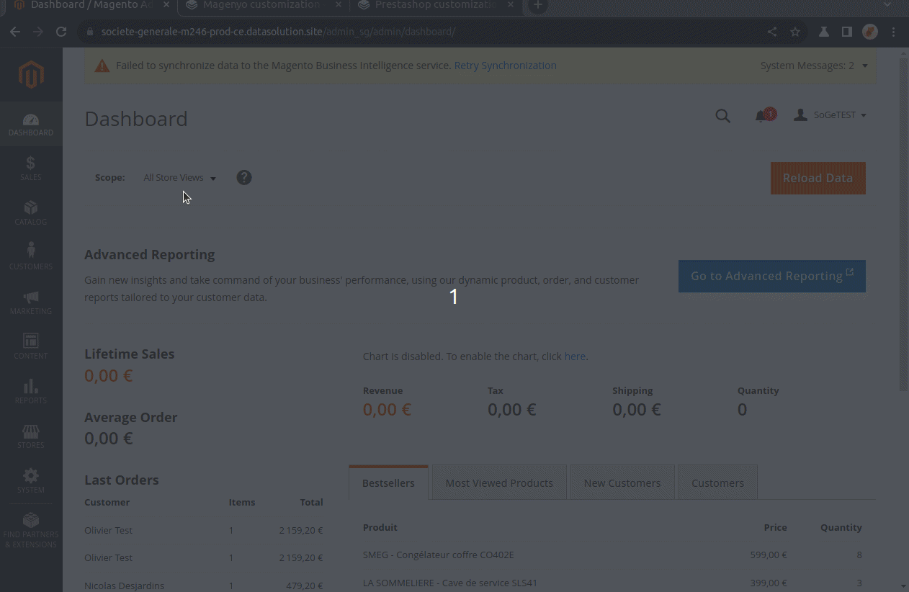

# Magento customization

Customization is found at "Stores" > "Configuration" > "scalexpert" > "Customization" menu.

<figure><figcaption>
Access scalexpert customization menu
</figcaption></figure>

Customization are available for each solutions activated.&#x20;

3 levels of customization are possible:

* on product pages
* on payment checkout pages
* on product categories&#x20;

## 1-Product pages customization

* Chose to display or not the solution insert on the product page. For more detail see [how to showcase solutions](../../../../solutions-reference/showcasing-solutions.md).&#x20;
* Chose the position of the solution insert into the page. 3 options are available: \
  \- "under product name",\
  \- "under quantity field",\
  \-  "under bloc: add to basket".
* Customize title of the solution. By default, title is pre-filled from API GET /eligible solutions. For more details see [API REFERENCE ](broken-reference)chapter.
* Customize subtitle of the solution. By default, title is pre-filled from API GET /eligible solutions. For more details see [API REFERENCE ](broken-reference)chapter (only available for Insurance solutions).
* Chose to display or not Société générale logo 

<figure><figcaption>
product page customization
</figcaption></figure>

## 2-Payment Checkout page customization

* Choose to display or not the solution among payment means list of check-out page.
* Choose the position in the list (enter a integer 1 to n, 1 = on top of the list, nothing on bottom of the list).&#x20;
* Customize title and subtitle fields of the solution. By default, title is pre-filled from API GET /eligible solutions. For more details see [API REFERENCE ](broken-reference)chapter.
* Chose to display or not Société générale logo 

<figure><figcaption>
check-out page customization
</figcaption></figure>

## 3-Product category customization

* Select list of product catalog category to exclude of the solution scope. if excluded the solution will not be promoted in the product and checkout pages.&#x20;

<figure><figcaption>
product categories customization
</figcaption></figure>
