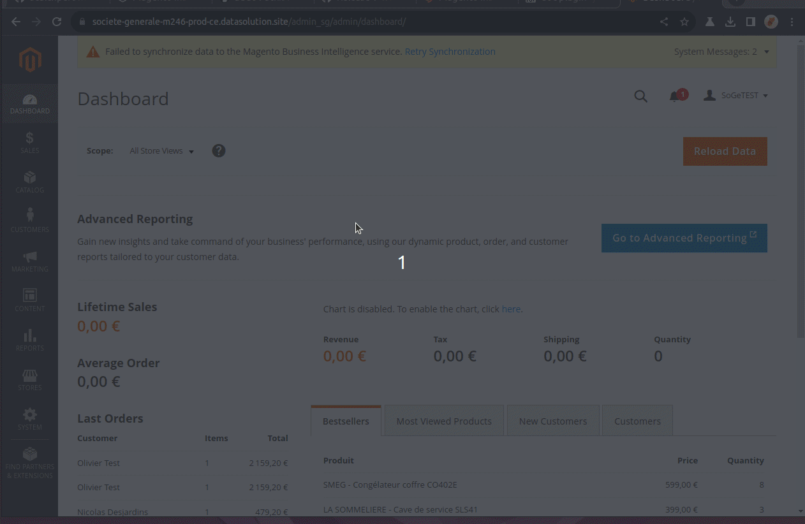

# Magento installation

## 1-Installation from GitHub


scalexpert Magento Github relases&#x20;


Install Magento from the following command lines. Make sure to replace {YOUR\_MAGENTO\_DIR} by your directory location and {LATEST-RELEASE} by the [latest](https://github.com/scalexpert/scalexpert-magento/releases/latest) scalexpert magento release.


Make sure you have enough rights to read,write,delete files or execute under delegation user rights (ex "sudo" command for linux).&#x20;



```bash
// Remove app/code/Scalexpert/Plugin folder if already exists.
rm -Rf {YOUR_MAGENTO_DIR}/app/code/Scalexpert/Plugin

// Unzip module archive in your Magento 2 app/code folder.
cd {YOUR_MAGENTO_DIR}/app/code
wget https://github.com/scalexpert/scalexpert-magento/releases/download/{LATEST-RELEASE}/scalexpert-plugin-{LATEST-RELEASE}.zip
unzip https://github.com/scalexpert/scalexpert-magento/releases/download/{LATEST-RELEASE}/scalexpert-plugin-{LATEST-RELEASE}.zip

// change to Magento installation root directory.
cd {YOUR_MAGENTO_DIR}

// Enable module
php bin/magento module:enable --clear-static-content Scalexpert_Plugin

//Upgrade database
php bin/magento setup:upgrade

// Re-run compile command
php bin/magento setup:di:compile

// Update static files
php bin/magento setup:static-content:deploy [locale]
```


### 2- Verify installation

To verify installation:

1. Connect your admin Magento dashboard
2. Under menu "Stores" click on sub-menu "Configuration"
3. Verify you have sub-menu "SCALEXPERT"

<figure><figcaption><p>Where to find menu scalexpert plugin</p></figcaption></figure>

### 3- To deactivate scalexpert Magento module (optional)


```bash
// In order to deactivate the module
cd {YOUR_MAGENTO_DIR}
php bin/magento module:disable --clear-static-content Scalexpert_Plugin
```


