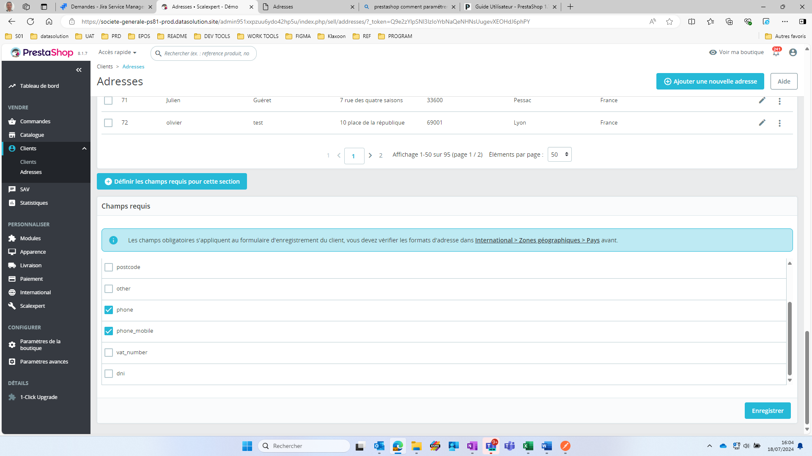
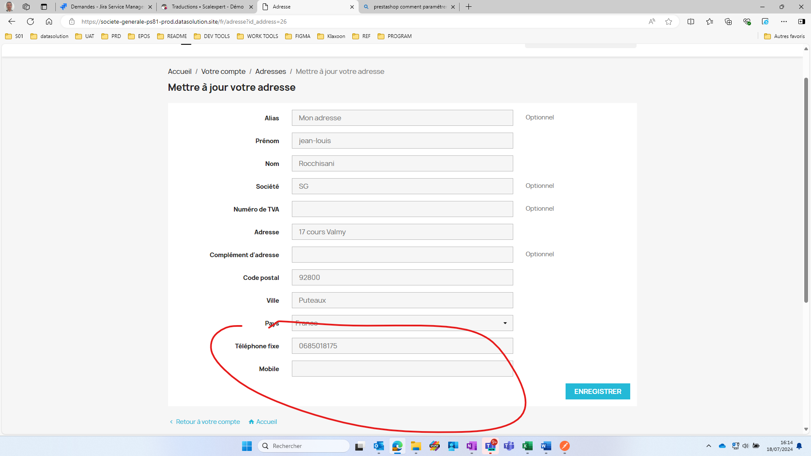

# Prestashop advanced features

1. Activate [debug mode ](prestashop-advanced-features.md#1-activate-debug-mode)
2. Set up the ["pulling of financing requests updates](prestashop-advanced-features.md#2-set-up-pulling-financing-requests-updates)" task on your server cron tab
3. Add a field "phone-mobile" to e-buyer address form&#x20;

### 1-Activate debug mode

At any moment you activate "Debug mode" on "scalexpert/admin" menu.

<figure><figcaption><p>Activate debug mode</p></figcaption></figure>

Once activated, any API requests will be logged on a file per day in the "{your server path}/prestashop/modules/scalexpertplugin/logs" directory.&#x20;

```bash
$ cd prestashop/modules/scalexpertplugin/logs
$ ls -l
$ total 376
-rw-r--r-- 1 daemon daemon    305 Aug  2 11:47 index.php
-rw-r--r-- 1 daemon daemon 358765 Nov  3 16:51 scalexperplugin-2023-11-03.log
-rw-r--r-- 1 daemon daemon  14972 Nov  5 11:25 scalexperplugin-2023-11-05.log
$ less scalexperplugin-2023-11-05.log
[2023-11-05 12:25:33] main.INFO: 65477bad91d74 Request POST /auth-server/api/v1/oauth2/token (environment=test) {"form_params":{"grant_type":"client_credentials","scope":"e-financing:rw insurance:rw"}} []
[2023-11-05 12:25:33] main.INFO: 65477bad91d74 Response /auth-server/api/v1/oauth2/token (environment=test) [] []
[2023-11-05 12:25:33] main.INFO: 65477badc4825 Request GET /e-financing/api/v1/eligible-solutions (environment=test) {"query":{"financedAmount":"500","buyerBillingCountry":"FR"}} []
[2023-11-05 12:25:35] main.INFO: 65477badc4825 Response /e-financing/api/v1/eligible-solutions (environment=test) {"code":200,"content":"{\"solutions\":[{\"solutionCode\":\"SCFRSP-3XTS\",\"familyCode\":\"SC\",\"marketCode\":\"FR\",\"conditions\":\"TS\",\"communicationKit\":{\"solutionCode\":\"SCFRSP-3XTS\",\"visualTitle\":\"<div class=scalexpert_title>Payez en 3 fois sans frais avec votre carte bancaire</div>\",\"visualDescription\":null,\"visualInformationIcon\":\"https://scalexpert.societegenerale.com/app/merchantKit/visual_information_icon.svg\",\"visualAdditionalInformation\":\"<p>Le paiement en 3 fois par carte bancaire est une solution de paiement qui vous permet d'échelonner le règlement de votre commande en 3 mensualités débitées sur le compte associé à votre carte bancaire.<br> Exemple : pour un achat de 600 € payé en 3 fois, vous réglez 3 échéances de 200€. Montant du financement : 600 €. TAEG FIXE: 0%. Taux débiteur fixe : 0%. Frais:0€. Montant total dû : 600€. Le prélèvement des éc
...
```


Please communicate logs files when you contact the support for any issues encountered.


### 2-Set up "pulling financing requests updates"

In order to pull "financing requests updates" every hour you must set up this task on your server using cron tab.

<figure><figcaption><p>Set up pulling financing requests updates</p></figcaption></figure>

<pre class="language-bash"><code class="lang-bash"><strong>$ crontab -e
</strong><strong># add this line at the end of your cron file
</strong>0 * * * * http://{Your web server name}/fr/module/scalexpertplugin/maintenance
$ crontab -l 
# list your cron file
...
# m h  dom mon dow   command
0 * * * * http://{Your web server name}/fr/module/scalexpertplugin/maintenance
</code></pre>

You can also manually launch the task. It will display "Cron OK" if every thing OK.

<figure><figcaption><p>Launch manually pulling of financing request updates</p></figcaption></figure>

### 3-Add field "phone-mobile" to e-buyer address form

Mobile phone is a mandatory field to initiate [e-financing subscription](../../../../api-reference/e-financing-api/). But sometimes we observed that e-buyer address form doesn't get the field "phone-mobile". in that case we assume to use the field "phone" instead but this is not ideal. We strongly recommended adding the field "phone-mobile". This could be added in Prestashop natively with a few configuration steps depicted below.

**Add field "phone-mobile" to your country setting in the menu "international/geographical areas/{your country}**

<figure><figcaption><p>Set address fields for each country </p></figcaption></figure>

**Define mandatory fields in the Contacts address menu**

<figure><figcaption><p>select which fields are mandatory</p></figcaption></figure>

**Check and correct the translation into your country language**

<figure><figcaption><p>translate into required language</p></figcaption></figure>

And that's it :tada:

<figure><figcaption><p>address form</p></figcaption></figure>
