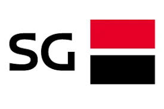
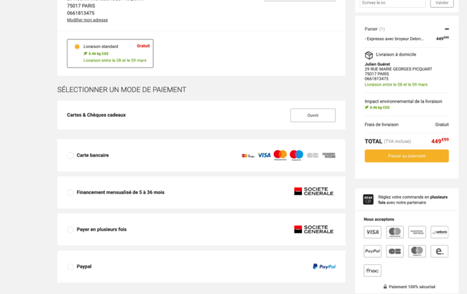

# 🆕 Prestashop customization

Customization is found at "scalexpert" > "Customization" menu.

<figure><figcaption>
access Magento scalexpert customization menu 
</figcaption></figure>

Customization are available for each solutions activated.&#x20;

4 levels of customization are possible:

* on product pages,
* on cart pages :new:,
* on payment checkout pages,
* on product categories.

## 1-Product pages customization

* Chose to display or not the solution insert on the product page. For more detail see [how to showcase solutions](../../../../solutions-reference/showcasing-solutions.md).&#x20;
* Chose the position of the solution insert into the page (only 1 position available "under bloc: add to basket" on this version of the plugin)
* Customize title of the solution. By default, title is pre-filled from API GET /eligible solutions. For more details see [API REFERENCE ](broken-reference)chapter.
* Customize subtitle of the solution. By default, title is pre-filled from API GET /eligible solutions. For more details see [API REFERENCE ](broken-reference)chapter (only available for Insurance solutions).
* Chose to display or not Société générale logo 

<figure><figcaption>
product page customization
</figcaption></figure>

## 2-Cart page customization

* Chose to display or not the solution insert on the cart  page. For more detail see [how to showcase solutions](../../../../solutions-reference/showcasing-solutions.md).&#x20;
* Chose the position of the solution insert into the page (only 1 position available "under bloc: add to basket" on this version of the plugin)
* Customize title of the solution. By default, title is pre-filled from API GET /eligible solutions. For more details see [API REFERENCE ](broken-reference)chapter.
* Customize subtitle of the solution. By default, title is pre-filled from API GET /eligible solutions. For more details see [API REFERENCE ](broken-reference)chapter (only available for Insurance solutions).
* Chose to display or not Société générale logo 

<figure><figcaption>
cart page customization
</figcaption></figure>

## 3-Payment Checkout page customization

* Customize title of the solution. By default, title is pre-filled from API GET /eligible solutions. For more details see [API REFERENCE ](broken-reference)chapter.
* Chose to display or not Société générale logo 

<figure><figcaption>
check-out page customization
</figcaption></figure>

## 3-Product category customization

* Select list of product catalog category to exclude of the solution scope. if excluded the solution will not be promoted in the product and checkout pages.&#x20;

<figure><figcaption>
product categories customization
</figcaption></figure>
