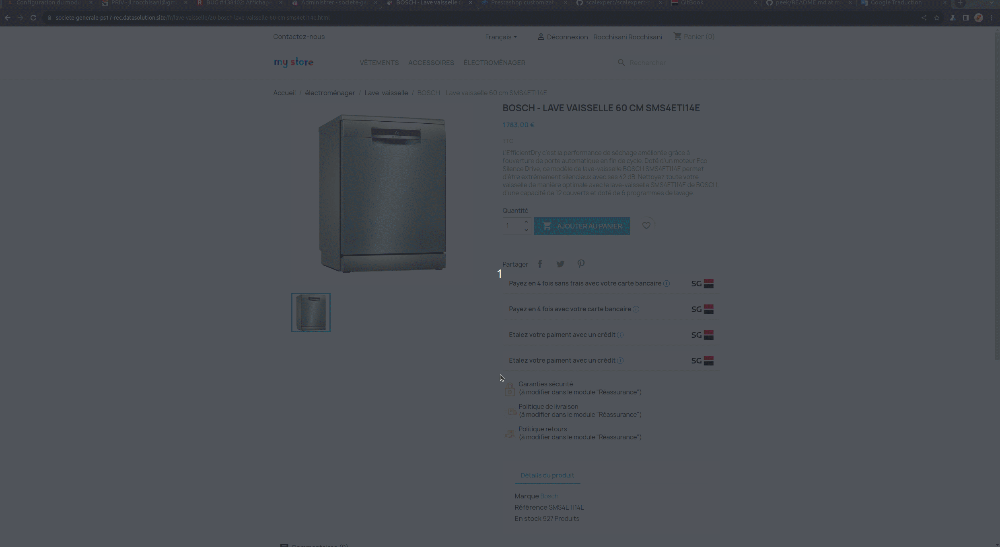

# Prestashop customization

Customization are available for each solutions activated.&#x20;

2 levels of customization are possible:

* on product pages
* on payment checkout pages&#x20;

<figure><figcaption>
Customize Scalexpert plugin
</figcaption></figure>

## 1-Product pages customization

* Chose to display or not the solution insert on the product page. For more detail see [how to showcase solutions](../../../../for-discovery/showcasing-solutions.md).&#x20;
* Chose the position of the solution insert into the page (only 1 position available "under bloc: add to basket" on this version of the plugin)
* Customize title of the solution. By default, title is pre-filled from API GET /eligible solutions. For more details see [API REFERENCE ](broken-reference)chapter.
* Customize subtitle of the solution. By default, title is pre-filled from API GET /eligible solutions. For more details see [API REFERENCE ](broken-reference)chapter (only available for Insurance solutions).
* Chose to display or not Société générale logo 

<figure><figcaption>
How solutions are displayed on product page
</figcaption></figure>

## 2-Payment Checkout page customization

* Customize title of the solution. By default, title is pre-filled from API GET /eligible solutions. For more details see [API REFERENCE ](broken-reference)chapter.
* Chose to display or not Société générale logo 

<figure><figcaption>
How solutions are displayed in checkout pages
</figcaption></figure>

## 3-Product category customization

* Select list of product catalog category to exclude of the solution scope. if excluded the solution will not be promoted in the product and checkout pages.&#x20;
