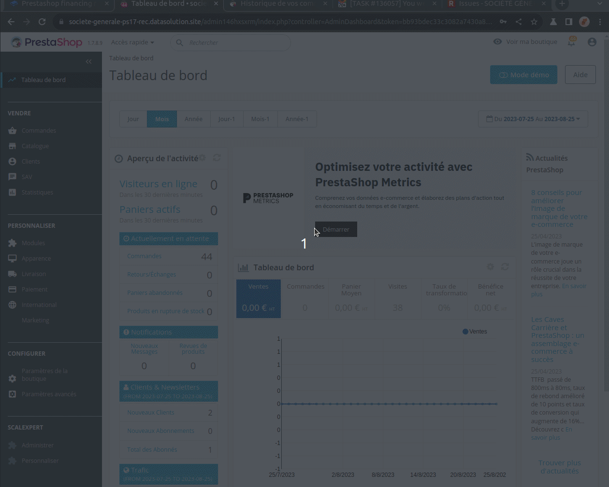

# Prestashop financing requests follow-up

## 1- For Customers from the store

Customers can follow their financing requests directly from the store at the "order details and history" native Prestashop page.

<figure><figcaption>
How customers can follow their financing requests
</figcaption></figure>

## 2-For Merchants from the back-office

Merchants can follow customers financing requests directly from the back-office at the "client order management" native Prestashop pages.

<figure><figcaption>
How merchants can follow customers financing requests
</figcaption></figure>

## 3- Financing request statuses

New prestashop order statuses have been created for reflecting the statuses of financing requests:

* Financing request requested
* Financing request initialized
* Financing request pre accepted
* Financing request accepted
* Financing request rejected
* Financing request aborted

See more details in [E-financing solutions life cycle](../../../../use-cases/credit/e-financing-status-life-cycle.md).


Statuses are collected at different times: after return of financing customer journeys, on periodic basis for asynchronous steps. Some mechanism for requesting statuses are in place (for more details see advanced configuration guide).

