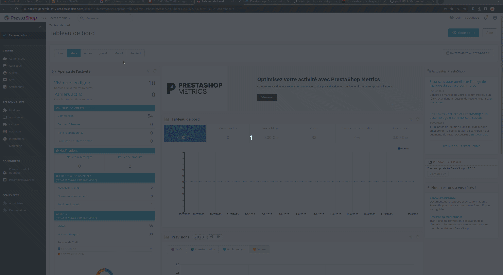

# Prestashop installation


It is strongly recommended you manage savingyour environment and be able to rollback it in case of any issue encountered during installation.&#x20;


## 1-Installation from GitHub



scalexpert Prestashop plugins has been developed in 2 versions to support:\
\- Prestashop 1.6 / 1.7\
\- Prestashop 8.1 and upper


Please check compatibility of your PHP version [here](../#plugins-php-requirements)


1. Go to scalexpert GitHub repository and download the version required.
2. Go to Prestashop backoffice, module menu and install your module.

<figure><figcaption>
Install Prestashop module
</figcaption></figure>

## 2-Setting your API keys


At that stage, you must have an account and get your customers API keys. More details [here](../../../../ready-to-start/before-you-start/).


1. Go to scalexpert menu  "administrer / paramétrer les clés".
2. Select your environment TEST or PRODUCTION.
3. Setup your API keys accordingly.
4. Verify your key.
5. Validate you setting.

<figure><figcaption>
Setup your API keys
</figcaption></figure>

## 3- Verify your activated solutions

1. Make sure you have all your solutions activated according to your contract. if not contact your support.
2. Confirm your solutions list or deactivate the ones you don't want used in your CMS. \
   If "Grouper les options de paiement" is enabled than all scalexpert paiements means will appear in 1 line in the paiement checkout page.&#x20;
3. Validate your setting.

<figure><figcaption>
Activate /Deactivate your solutions
</figcaption></figure>
