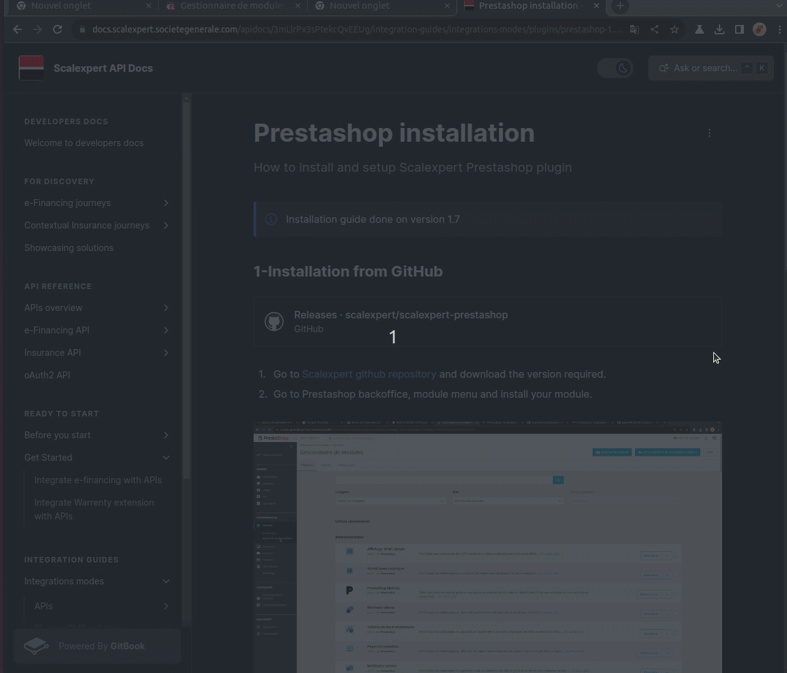

# Prestashop


Versions available are 1.6, 1.7, 8.1


## Installation from Github

1. Go to [Scalexpert github repository](https://github.com/scalexpert/scalexpert-prestashop) and download the version required
2. Go to Prestashop backoffice, module menu and install your module

<figure><figcaption>
Install Prestashop module
</figcaption></figure>


Github scalexpert Prestashop repository


1.
