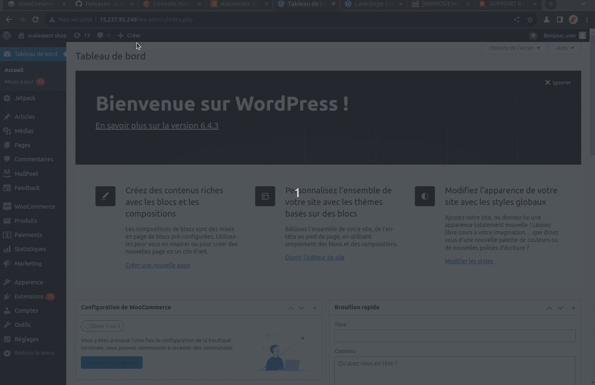

# WooCommerce  installation


Before you start ! It is strongly recommended you manage saving your environment and be able to rollback it in case of any issue encountered during installation.&#x20;


## 1-Installation from GitHub



scalexpert WooCommerce plugins has been developed in 2 configurations:\
\- WooCommerce 8.3, Wordpress 6.3, PHP 7.4\
\- WooCommerce 8.3, Wordpress 6.4, PHP 8.2


You don't find your configuration. Don't panic! :cry:  Let us know what is your configuration we will answer on the compatibility or possible solutions.

By the way, we recommended you updating version of PHP, WordPress to align with the configurations tested.&#x20;


1. Go to [scalexpert GitHub repository](https://github.com/scalexpert/scalexpert-woocommerce/releases) and download the version required.
2. Go to WooCommerce backoffice, module menu and install your plugin.
3. Once extension installed, activate it.

<figure><figcaption>
Install your extension and activate it
</figcaption></figure>

## 2-Setting your API keys


At that stage, you must have an account and get your customers API keys. More details [here](../../../../ready-to-start/before-you-start.md).


1. Go to scalexpert menu  "SG scalexpert / Administrer".
2. Select your environment TEST or PRODUCTION.
3. Setup your API keys accordingly.
4. Verify your key.
5. Validate you setting.

<figure><figcaption>
Enter your API keys and verify it
</figcaption></figure>

## 3- Verify your activated solutions

1. Make sure you have all your solutions activated according to your contract. if not contact your support.
2. Confirm your solutions list or deactivate the ones you don't want used in your CMS. \

3. Validate your setting.

<figure><figcaption>
Activate / deactivate your solutions
</figcaption></figure>
