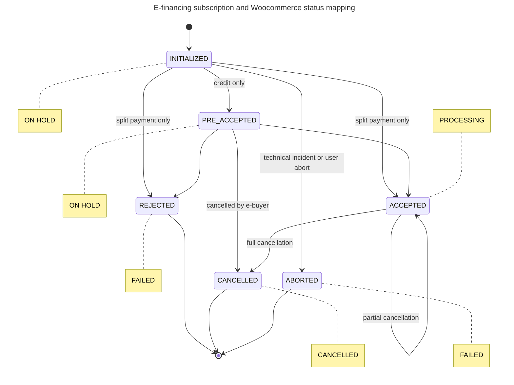

# 🆕 WooCommerce statuses mapping

### How e-financing map WooCommerce statuses

In WooCommerce, orders follow a standard lifecycle with predefined statuses. The Scalexpert plugin is designed [to synchronize these statuses with its own lifecycle.](woocommerce-statuses-mapping.md#e-financing-statuses-diagram-with-woocommerce-mapping) As a result, when the e-financing subscription status changes, it automatically updates to the corresponding WooCommerce status. Ensure the "pulling job" is enabled to allow


Note that not all WooCommerce statuses directly correspond to e-financing statuses. For example, the WooCommerce status "TERMINATED" is not mapped in e-financing. This status is used by merchants when an order is completed (fully paid and delivered), whereas e-financing only pertains to the payment or financing of


For more information read Guideline on WooCommerce documentation:


WooCommerce order status management


### e-financing statuses diagram with WooCommerce mapping

