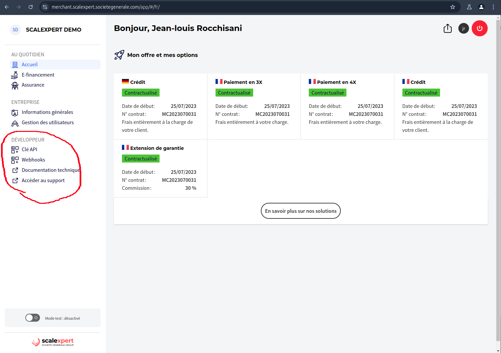

# 🆕 API developer space (merchant portal)


It is now easier to get your API keys from a dedicated **new space** (developers menu) **on the merchant portal!**


<figure><figcaption></figcaption></figure>

2 steps are only needed to collect your API keys:

### Connect your developer space


[account-creation.md](account-creation.md)


### Collect your API keys


[api-key.md](api-key.md)



The former "developer portal" interface is still available but will be reserved for advanced usages only.

