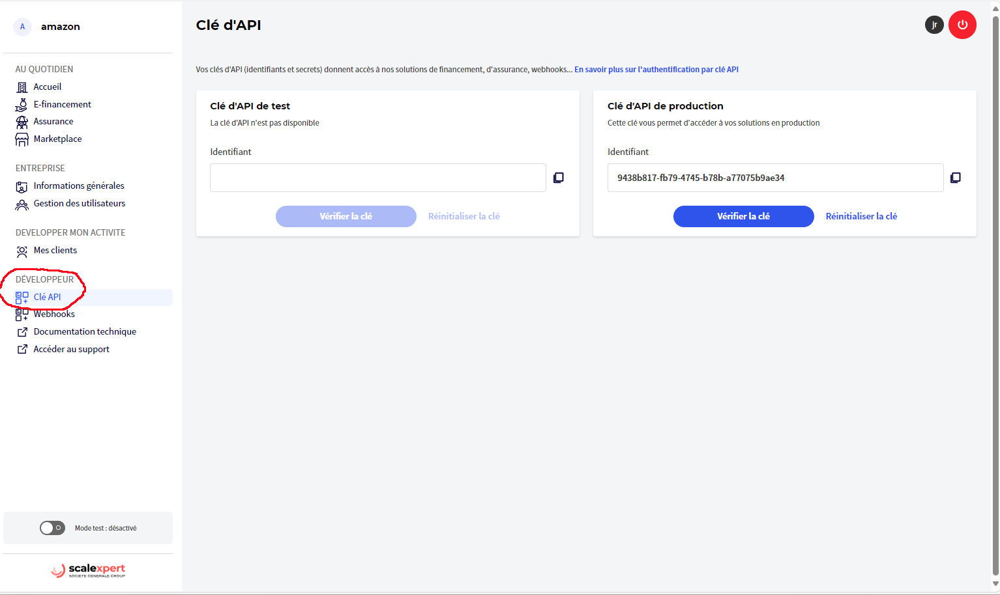

# 🆕 API key


This is a new feature replacing former access to the [developer portal](../../api-reference/apis-common/api-console-advance-features/) (API console). API console would be still available for advanced needs.



For security reasons API key secret would be never sent by email. The only way to display it would be at reset operation! For more details please consult our [security best practices.](../../security/security-best-practices.md)&#x20;


Get your API keys in 3 steps:



Once connected to the merchant portal, access your "developer space" by clicking on the menu  "DEVELOPER "and sub-menu "API Keys".

<figure><figcaption>
access the developer menu "API Key" page
</figcaption></figure>



API key page will display your 2 kind of Keys:\
\- 1 API key test (UATC)\
\- 1 API key production (PROD)\
for more details on environment please consult our [API reference guide](../../api-reference/apis-common/api-urls.md).&#x20;

For each API key, you will see an Identifier (client Id) that have been generated.&#x20;

Important: an empty key (client Id) would mean that your "on boarding key activation" step is not yet completed or something wrong. If so please [contact support team](../../support/how-to-contact-us.md#contact-support) :e-mail:

<figure><figcaption>
API keys test and production
</figcaption></figure>



Choose your API key test or production and click on "reset" button to obtain your secret

<figure><figcaption>
reset your secret key
</figcaption></figure>

A confirmation page will be displayed **because this operation is irrevocable** !

<figure><figcaption>
confirm reset operation
</figcaption></figure>

A new secret will be created and displayed. **Copy it and store it securely** (see [security best practices](../../security/security-best-practices.md)) because **it will be not possible to display after.** But at anytime, you can redo resetting operation as much as you would need.

<figure><figcaption>
your secret have been generated successfully
</figcaption></figure>

<figure><figcaption>
Display or copy your secret
</figcaption></figure>



At any time you can verify your secret!

<figure><figcaption>
verify your secret
</figcaption></figure>

<figure><figcaption>
enter your secret to verify
</figcaption></figure>

<figure><figcaption>
your secret has been verified successfully!
</figcaption></figure>

<figure><figcaption>
your secret is not corresponding to your key!
</figcaption></figure>



