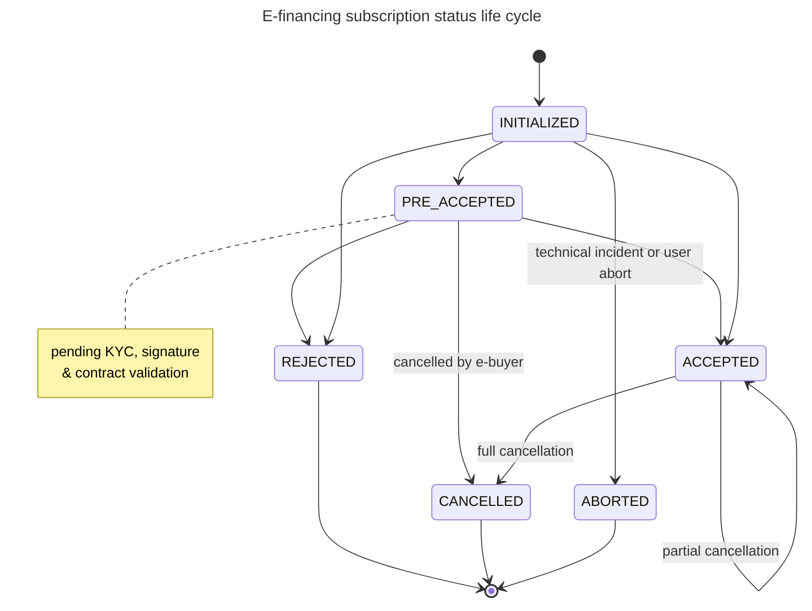

# E-financing Status life cycle

### Statuses  definition:

* INITIALIZED: Subscription has been initialized by financial institution
* PRE\_ACCEPTED: Subscription pre-accepted pending KYC, contrat signature and final acceptation by financial institution
* ACCEPTED: Subscription accepted by financial institution
* REJECTED: subscription rejected by financial institution
* ABORTED: subscription has been aborted due to technical incident or user abort
* CANCELLED: subscription cancelled by financial institution or e-buyer&#x20;

### Status life cycle:

