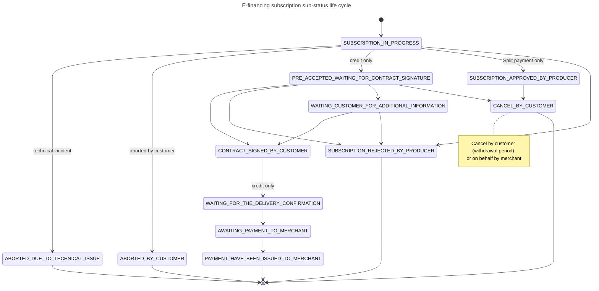

# E-financing Status life cycle

### Statuses  definition:

* INITIALIZED: Subscription has been initialized by financial institution
* PRE\_ACCEPTED: Subscription pre-accepted pending KYC, contrat signature and final acceptation by financial institution
* ACCEPTED: Subscription accepted by financial institution
* REJECTED: subscription rejected by financial institution
* ABORTED: subscription has been aborted due to technical incident or user abort
* CANCELLED: subscription cancelled by financial institution or e-buyer&#x20;

### Status life cycle:

### Detail of sub-statuses

| Status       | Sub-statuses                                                         | Comment                                                                                                                                                      |
| ------------ | -------------------------------------------------------------------- | ------------------------------------------------------------------------------------------------------------------------------------------------------------ |
| INITIALIZED  | SUBSCRIPTION IN PROGRESS                                             | E-buyer initiate the subscription and is fulfilling its e-financing journey                                                                                  |
| PRE-ACCEPTED | SUBSCRIPTION PRE-APPROVED BY PRODUCER WAITING FOR CONTRACT SIGNATURE | E-buyer complete e-financing journey and get pre-approval from producer. Next step is contract signature.                                                    |
| PRE-ACCEPTED | CONTRACT SIGNED BY CUSTOMER                                          | Contract signed by e-buyer                                                                                                                                   |
| PRE-ACCEPTED | WAITING CUSTOMER FOR ADDITIONAL INFORMATION                          | Contract pending waiting for e-buyer additional information                                                                                                  |
| ACCEPTED     | SUBSCRIPTION APPROVED BY PRODUCER                                    | Producer accepted e-financing directly (split payment only)                                                                                                  |
| ACCEPTED     | WAITING FOR THE DELIVERY CONFIRMATION                                | Producer accepted e-financing. Next step is delivery to be confirmed by merchant (credit only).                                                              |
| ACCEPTED     | AWAITING PAYMENT TO MERCHANT                                         | Delivery has been confirmed by merchant and producer will fund the merchant (credit only).                                                                   |
| ACCEPTED     | PAYMENT HAS BEEN ISSUED TO MERCHANT                                  | E-financing has been funded (credit only).                                                                                                                   |
| REJECTED     | SUBSCRIPTION REJECTED BY PRODUCER                                    | Subscription has been rejected by producer (payment or credit rejected).                                                                                     |
| ABORTED      | ABORTED BY CUSTOMER                                                  | E-buyer aborted its e-financing journey or its session expired.                                                                                              |
| ABORTED      | ABORTED DUE TO TECHNICAL ISSUE                                       | A technical issue has been encountered during e-financing journey.                                                                                           |
| CANCELLED    | CANCELLED BY CUSTOMER                                                | E-financing subscription has been cancelled by customer (withdrawal period) or by merchant on behalf of e-buyer (cancellation full ou partial of delivery).  |

