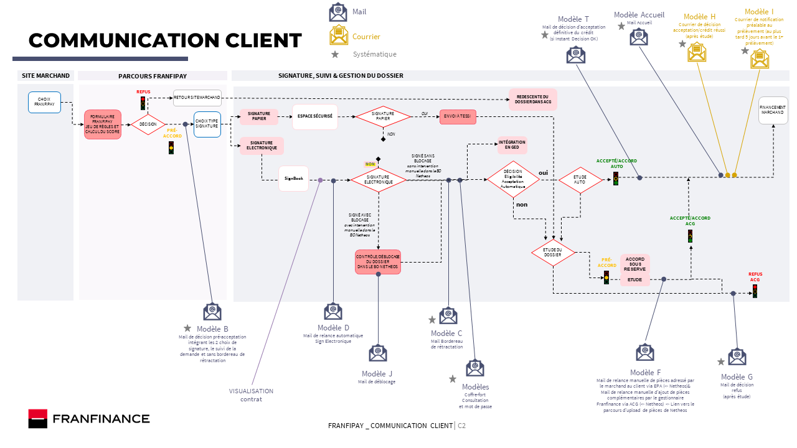

# Long Term Credit Journey France

## Run a Long Term Credit Journey for French Buyers

Run a Long Term Credit Journey is four steps process:


Long Term e-financing credit solution is proposed by FRANFINANCE subsidiary For France.


1. e-Financing Long Term Credit journey for French buyers \
   This step is executed by the producer (FRANFINANCE). This journey consist of a few screens credit experience of which the buyer will complete its credit application including KYC and contract signature before getting a pre-acceptation from the bank.&#x20;
2. Confirmation page on e-commerce website\
   After pre-acceptation from the bank, the buyer will be redirected on the e-merchant confirmation e-website page. The merchant will have to access the [`GET credit/v1/subscriptions/{creditSubscriptionId} API`](../../api-reference/e-financing-api/) in order to get the status. The status could be either PRE-ACCEPTED or REJECTED (cf.  [status life cycle](e-financing-status-life-cycle.md)).&#x20;
3. Since contract is signed, the bank will confirm final acceptation. On daily basis the merchant will have to access with [`GET credit/v1/subscriptions/{creditSubscriptionId} API`](../../api-reference/e-financing-api/) in order to get the final status. The status could be either ACCEPTED or REJECTED. If ACCEPTED the merchant can deliver the goods to the buyer.

<figure><figcaption>
LT credit France
</figcaption></figure>

### Long term credit journey communications/exchanges to e-buyer

Please below all communication/exchanges done from producer (FRANFINANCE) to e-buyer regarding its long credit journey subscription. This cover all statuses from INITIALIZED to CONTRACT SIGNED (see more details on status [here](e-financing-status-life-cycle.md)).


Be aware that all exchanges with e-buyer is always under responsibility of FRANFINANCE producer. In case, your customer ask for information concerning its subscription, you would advise him to access its "Customer FRANFINANCE" website[https://espaceclient.franfinance.fr/grenadine/](https://espaceclient.franfinance.fr/grenadine/).  He would need to provide its FRANFINANCE producer contract number communicated at first email exchange when he received the pre-acceptance.

In general, when e-buyer had signed its contract and was still waiting for an answer, the reason is that a missing document or information is pending. He would found all details in its FRANFINANCE customer website.&#x20;


<figure><figcaption>
FRANFINANCE long credit communication to e-buyer
</figcaption></figure>
