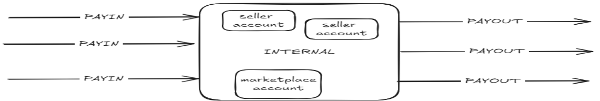
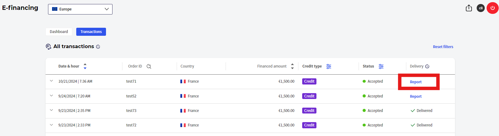
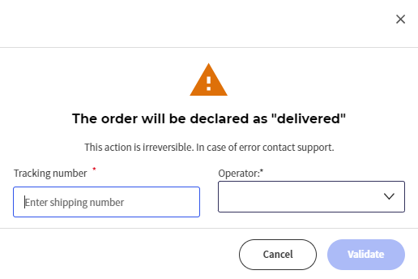

# 🆕 Delivery e-financing journey

## A - From merchant portal: **Payment to the merchant & proof of delivery**


This article concerns payment to the merchant when a customer (ebuyer) has taken out a 3X/4X payment or credit offer. The time taken to pay the merchant depends on the financing method chosen by the customer (ebuyer).


#### **3X/4X financing**

Payment to the merchant is made within a maximum of 48 hours of acceptance of the customer's file by the lender. There is no need for the merchant to intervene, as this process is fully automatic.

#### **Credit financing**

Depending on the lending institution, the payment period varies from 2 to 8 days maximum after confirmation by the merchant that the financed products have been delivered to the customer (ebuyer). The procedure used by the merchant to confirm delivery is described below.

### **Step 1: Connect to the merchant portal**

From the scalexpert website, log in to your merchant area (top right, ‘Log in’ button) and enter your login details.

 

### **Step 2: In the merchant portal, select the transaction for which you want to confirm the delivery**

Go to the list of transaction in the e-financing section.

In the list of transactions, you can use several filters (date, order ID, type of financing, etc.) to find the order for which you want to confirm delivery.

If the order is in “Accepted” status, then you'll have access to the button “Report” on the right.

### **Step 3: Confirm delivery of the order**

On the delivery screen, please enter the “Shipping number” and the “Operator”, then click on “Validate”

## B - Confirm your delivery though API

You can confirm you delivery though API [`e-financing/api/v1/subscriptions/{creditSubscriptionId}/_confirmDelivery`](../../../api-reference/e-financing-api/)

## C -Confirm your delivery though your CMS

You can also confirm your delivery through your CMS (PRESTASHOP, MAGENT, WOOCOMMERCE ...) . please consult CMS guides [here](../../../integration-guides/integrations-modes/plugins/).
