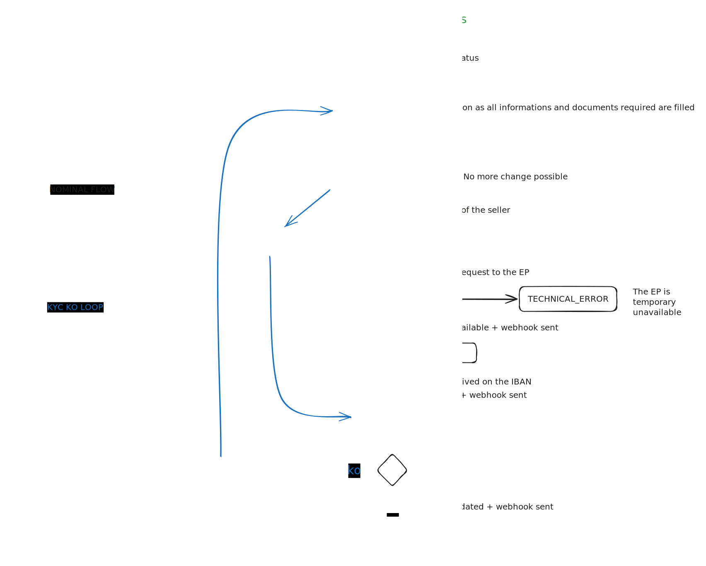

# 🚧 Marketplaces journeys

## Developer how-to guides

Follow these step-by-step guides for integrating Marketplace Services flows and seller verification.

The guides include walkthroughs on testing and integrating Marketplace Services features. Refer to the related guides below:

1. Look after the way to connect and use our APIs
   1. [authorization-server-api.md](../api-reference/authorization-server-api.md "mention")
   2. Scope for marketplace is: _marketplace:rw_
   3. You should have a _solutionCode_
2. Integrate the endpoints regarding the onboarding of your sellers
   1. [endpoints-sellers-on-boarding.md](../api-reference/marketplace-services-api/uat-api-for-partners/endpoints-sellers-on-boarding.md "mention")
3. Integrate the remaining endpoints to manage orders and subscriptions
   1. [endpoints-cash-management.md](../api-reference/marketplace-services-api/uat-api-for-partners/endpoints-cash-management.md "mention")

## Glossary

* Merchant: the marketplace itself
* Seller : the company who sells products on the marketplace website.
* Contact : physical person having a relashionship direct or indirect with a seller entity. Also known as UBO (Ultimate Beneficiary Owner)
* Account/Wallet : payment account of the seller or the marketplace
* PAYIN : all money flow regarding incoming cash
* PAYOUT : all money flow regarding outgoing cash
* INTERNAL : all money flow between marketplace and sellers accounts
* KYB: Know Your Business. To simplify, in this document, as we realize assessment on a legal entity and on serveral physical person at the same time, we only use KYC term.
* KYC: Know Your Customer


***

## 1 - Prerequisite: the Marketplace onboarding

First of all, we assume that you are onboarded and have an acces to the merchant portal.


[dev-portal](../ready-to-start/dev-portal/)


## 2 - Seller on boarding and [KYC](marketplaces-journeys.md#glossary)

First of all, to start working with Marketplace Services, you have to integrate a set of endpoints to onboard your sellers. These endpoint are designed to support the onboarding in multiple-times without having to save any sensitive data on your side. The objectives of this step is to ensure that your sellers are compliant with regulation rules.

### 2.1 - Onboarding & KYC endpoints

<table data-header-hidden data-full-width="true"><thead><tr><th></th><th></th><th></th></tr></thead><tbody><tr><td><strong>HTTP request</strong></td><td><strong>Endpoint</strong></td><td><strong>Usage</strong></td></tr><tr><td>PUT</td><td>/sellers/{merchantSellerId}</td><td>Start the onboarding of a seller based on your own id.</td></tr><tr><td>GET</td><td>/sellers/{merchantSellerId}</td><td>Get all values already filled of a seller</td></tr><tr><td>POST</td><td>/sellers/{merchantSellerId}/contacts</td><td>Add a physical person on a existing seller. All effective beneficiaries must be added.</td></tr><tr><td>PATCH</td><td>/sellers/{merchantSellerId}/contacts/{contactId}</td><td>Change some informations about a contact</td></tr><tr><td>DELETE</td><td>/sellers/{merchantSellerId}/contacts/{contactId}</td><td>Delete a contact</td></tr><tr><td>POST</td><td>/sellers/{merchantSellerId}/documents</td><td>Add a document attached to a seller (KBIS, fiscal statement, etc.)</td></tr><tr><td>DELETE</td><td>/sellers/{merchantSellerId}/documents/{documentId}</td><td>Delete a seller document</td></tr><tr><td>POST</td><td>/sellers/{merchantSellerId}/contact/{contactId}/documents</td><td>Add a document attached to an effective beneficiary (Id card, passport, etc.)</td></tr><tr><td>DELETE</td><td><p>/sellers/{merchantSellerId}/contact/{contactId}/documents/{documentId</p><p>}</p></td><td>Delete a contact document</td></tr><tr><td>POST</td><td>/sellers/{merchantSellerId}/_assess-kyc</td><td>Start the KYC of a specific seller and all the KYC of the contacts attached to this seller.</td></tr></tbody></table>


[endpoints-sellers-on-boarding.md](../api-reference/marketplace-services-api/uat-api-for-partners/endpoints-sellers-on-boarding.md)


### 2.2 - Onboarding & KYC journey

  **Objective: launch the KYC review of a seller**

As a marketplace you need to onboard sellers with your back-office. You will have to request to your sellers to complete all datas requested for kyc in the seller onboarding API. Each time a new data is filled, you can use the appropriate endpoint to store the values filled. Your seller will be able to fill requested informations in multiple times without loosing any data.


During the onboarding only, the solution is designed to allow the marketplace to use his own ID to manage the sellers in the scaleXpert environement. After the onboarding, a ScaleXpert "_sellerId_" will be used.



For an existing seller, the marketplace make a KYC renewal for the seller. Some fields already known by the marketplace and could be pre-filled.


#### Sequence diagram overview of onboarding seller endpoints


At any time, as a Markeplace, you can retreive all informations already provided with the GET /sellers/{merchantSellerId}. This endpoint gives you all informations, documents and contacts sent previously except the document itself (for security reason).

You can also use other http verbs to manage each party (GET/PATCH/DELETE). See [#id-2.1-onboarding-and-kyb-endpoints](marketplaces-journeys.md#id-2.1-onboarding-and-kyb-endpoints "mention") for full possibilities.

### 2.3 - Onboarding rules and other explanations

#### 2.3.1 The Seller

The seller object describe the company who sell goods/services on the marketplace operator website. It is a _Legal Entity_. Mandatory fields to launch the KYC process are the following:

* `merchantSellerId`
  * The unique ID of the seller in the marketplace operator system. Will be used during the onboarding process only. Then, the ScaleXpert ID will be used.
* `legalEntityName`
  * The legal name which with the company is officially registered
* `address`
  * The address of headquarters of the company. With subfields `streetNumber`, `streetName`, `zipCode`, `cityName`, `countryCode`
* `email`
  * Email address used to contact the company in case of questions or problems
* `phoneNumber`
  * Phone number of the company
* `legalFormAcronym`
  * The legal form/category of the company. You may check out [the authoritative list](https://www.insee.fr/fr/information/2028129)
* `legalEntityCapitalizationAmount`
  * Legal entity capitalization amount in a main unit of the currency
* `legalEntityCapitalizationCurrency`
  * Currency code of the share capital above
* `businessActivity`
  * `typeCode`
    * Qualify the type of data for code field.&#x20;
  * `code`
    * &#x20;The Business Sector of the company (European classification of activities or french Nomenclature of activities). The typeCode field is linked to this field. You may check out [the authoritative list](https://www.insee.fr/fr/information/2120875)
* `externalRegistrations` (list of codes)
  * `code`
    * The list of externalRegistration codes to be provided is: `VAT`, `SIRET`, `REGISTRATION_NUM`, `TIN` - The requirement of these codes is defined as follows: \
      \- The code `VAT` is always required. \
      \- The code "`TIN`"is required when the address.countryCode is not FR. It is required to specify the taxPayer Identification number of the provided taxResidenceCountry. \
      \- The code `SIRET` is required when the address.countryCode is FR. SIREN is not accepted.\
      \- The code `REGISTRATION_NUM` is required when the address.countryCode is other than the FR.
  * `value`
    * Value of the selected code above
  * `date`
    * Date of the code offical delivery
* `legalNumberOfEmployeeRange`
  * Number of employee working in the company
* `legalNetIncomeRange`
  * The Profit of a business after deducting expenses. Annual value.
* `legalAnnualTurnover`
  * The total income your business makes over one financial year
* `bankingInformation`
  * `accountName`
    * Name of the owner of the account which will receive PAYOUTS
  * `iban`
    * Iban of the account which will receive PAYOUTS
  * `bic`
    * BIC associated with the IBAN above
  * `currency`
    * Currency of the account


**2.3.2 The contacts**&#x20;

After the seller creation, the marketplace must add all the contacts required. Contacts to be added are all the direct and indirect owner of the seller. Contacts are only _physical person_.


To know the criterias of an Ultimate Beneficiary Owner (UBO) of a company: [RBE\_Fiche\_pratique\_schemas (greffe-tc-paris.fr)](https://www.greffe-tc-paris.fr/uploads/paris/Fiches%20RCS/RBE_Fiche_pratique_schemas.pdf)


Mandatory fields to launch the KYC process are the following:

* `firstName`
  * First name of the contact
* `lastName`
  * Complete last name of the contact according to identity proof
* `email`
  * Email address to join the contact
* `phoneNumber`
  * Phone number of the contact including prefix
* `involvement`
  * `type`
    * Role of the contact in the company
  * `startDateTime`
    * Date of role has started
* `occupationType`
  * Type of occupation of the contact
* `personalAssets`
  * Total personnal assets value owned by the contact
* `address`
  * The address of the contact. With subfields `streetNumber`, `streetName`, `zipCode`, `cityName`, `countryCode`
* `effectiveBeneficiary`
  * Percentage of ownership by the contact on the company. [Rules of calculation here](https://www.greffe-tc-paris.fr/uploads/paris/Fiches%20RCS/RBE_Fiche_pratique_schemas.pdf).
  * Note that sum of contact.effectiveBeneficiary can be < 100% because owner with less than 25% are not considered.
* `commonTitle`
  * Honorific title
* `birthDate`
  * The birth date of the contact
* `birthCityName`
  * The city where the contact was born
* `birthCountryCode`
  * The country where the contact was born
* `nationality`
  * The nationality of the contact
* `incomeRange`
  * The value of monthly revenue of the contact
* `taxResidenceCountryCode`
  * The country where the contact pay taxes
* `taxResidenceTaxPayerId`
  * The unique reference of the contact as tax-payer delivered by the country above


**2.3.3 The documents**

To be realized, the KYC required some documents to proof identity of the company and of each added contacts. It is mandatory to upload at least one document per seller and one document per contact to launch the KYC review process.&#x20;

Documents rules:

* A document cannot be updated but only added or deleted
* A document is never given back. One way only. Not present in a GET answer.
* A document has restricted extensions and size (see Swagger for details)
* For the Seller, minimum mandatory is the `COMPANY_REGISTRATION` proof
* For a contact, minimum mandatory is the `IDENTITY_CARD` or the `PASSPORT`

Documents fields:

* `name`
  * The name of the document with the extension included
* `fileContent`
  * The base64encoded document
* `type`
  * The category of the document

### 2.4 - Launch the KYC

Once you have filled all the required fields, added all contacts (at least one) according company owner rules, and added at least one document for the company and one per contact, you are able to call the `/_assess-kyc` endpoint.

This request succeed only when sellers and contacts status are COMPLETE or VALIDATED

To verify that you can request a KYC validation, you can use the GET sellers/{merchantSellerId} endpoint. This endpoint retreive all the data and document already provided and give a status on them. You will have a structure like this:

* **seller**
  * documents
    * status (REGISTERED, PENDING\_VALIDATION, VALIDATED, REFUSED)
  * dataStatus (COMPLETE, INCOMPLETE, PENDING\_VALIDATION, VALIDATED)
  * documentListStatus (COMPLETE, INCOMPLETE, PENDING\_VALIDATION, VALIDATED)
  * **contacts**
    * documents
      * status (REGISTERED, PENDING\_VALIDATION, VALIDATED, REFUSED)
    * dataStatus (COMPLETE, INCOMPLETE, PENDING\_VALIDATION, VALIDATED)
    * documentListStatus (COMPLETE, INCOMPLETE, PENDING\_VALIDATION, VALIDATED)

The seller (Legal entity) and each contacts (physical person) have both 3 status:

* Status regarding the completion of their data
* Status regarding uploaded documents
* Status regarding the number of document uploaded

When all status are COMPLETE and REGISTERED, you are able to the first call of `/_assess-kyc` endpoint.


Then, the endpoints are locked until the KYC review is done.&#x20;


An other way to know what data are missing is to look after the list provided when calling the PUT /sellers.

For example:

```json
{
  "dataStatus": "INCOMPLETE",
  "missingData": [
    "email",
    "phoneNumber",
    "legalFormAcronym",
    "legalEntityCapitalizationAmount",
    "legalEntityCapitalizationCurrency",
    "businessActivity",
    "businessActivity.typeCode",
    "legalAnnualTurnover",
    "bankingInformation",
    "bankingInformation.accountName",
    "bankingInformation.iban",
    "bankingInformation.bic",
    "bankingInformation.currency"
  ]
}
```



### 2.5 - The IBAN verification

To realize the KYC, as additional mesure, we have to receive a fund transfer of 1€ from the bank account of the seller. To do this, we associate for each KYC process one unique IBAN dedicated per seller. A few minutes after requesting KYC, a WebHook `MP_IBAN_AVAILABLE_FOR_PAYMENT` will be sent and the IBAN will be available on the seller endpoint.&#x20;

In the GET /sellers/{merchantSellerId} answer body, there is the field:

* `identityVerification`
  * `virtualIban`
    * `iban`
      * The IBAN beneficiary of the 1€ transfer&#x20;
    * `bic`
      * The BIC associated with the IBAN above
    * `type`
      * The only way supported today is VIRTUAL\_IBAN

This IBAN is to be send to the seller to finalize the KYC submission. The KYC will not be analyzed (and will not be validated) until the fund transfer of 1€ is not received. This fund transfer can be either in a classical SCT (2 or 3 days to be received) or Instant SCT (10 seconds to be received). This transfer MUST be realized from the account of the seller (opened with the name of the company).


The 1€ sent are loosed for the seller if the KYC is definitively refused (specific use cases).



### 2.6 - KYC in progress

As soon as the 1€ transfer will be received, you will be notified by the `MP_KYC_IN_PROGRESS` webhook. It means that an operator will check all the information provided for this seller and to give a status within the next 48 hours. Then you will receive either an approval `MP_KYC_VALIDATED` or a refusal `MP_KYC_REFUSED`.

### 2.7 - KYC refused

If the webhook received is a `MP_KYC_REFUSED`, you have to ask to the seller to make changes.&#x20;

Here are the different status (requesting a GET /sellers/{merchantSellerId} you can have, and the change to be done.

#### 2.7.1 Documents

* `documents.status`  is now `REFUSED`
  * Look after the field `kycReviewComment` to know the reason and upload a new one if needed
*   `contact.documents.status`  is now `REFUSED`

    * Look after the field contact.kycReviewComment to know the reason and upload a new one if needed


#### 2.7.2 Contacts

* `contacts.dataStatus` is now `INCOMPLETE`
  * One or more fields are to be changed because of some wrong or incoherent values. More informations are given on the `contacts.kycReviewComment` field


#### 2.7.3 Sellers

* `dataStatus` is now `INCOMPLETE`
  * One or more fields are to be changed because of some wrong or incoherent values. More informations are given on the `kycReviewComment` field
  * One or more effective beneficiary (contacts) are missing. In this case, the `kycReviewComment` field will also be used to ask to create the missing contacts.





### 2.8 - Submit KYC again

After the requested change are made: new documents uploaded or data changed, a new request "/_assess-kyc"_ should be called. Then, the different status are again in `PENDING_VALIDATION` and any change is again blocked during 48 hours to be verified.


### 2.9 - Webhooks

During the onboarding process, you will receive webhooks at each step of onboarding to follow the completion without having to pull GET requests every minute.

For the complete list, see the dedicated page : [Webhook table](../api-reference/merchant-webhooks-api/webhook-event-types.md#solution-marketplace-services-event-types) of Marketplace Services.

And to manage your webhooks subscriptions, go there:&#x20;


Before your first seller onboarding, make sure you realized the webhook intergration otherwise you will not be able to follow the onboarding process steps correctly.


#### 2.9.1 Overwiew of webhooks during the onboarding process

First you have to complete requested data described in the previous chapter, then you make your first call to the endpoint /_assess-kyc._ A few time after, you will receive the webhook MP\_IBAN\_AVAILABLE\_FOR\_PAYMENT. This webhook is sent only once.

Then, as soon as the 1€ are receveived on the IBAN, you will receive the webhook MP\_KYC\_IN\_PROGRESS. THis webhook means that the data and documents will be controled soon.

Then, if the kyc is validated, you will receive the final webhook MP\_KYC\_VALIDATED.\
Otherwise, you will receive a MP\_KYC\_REFUSED webhook. As soon as you request a new assess-kyc (after changes made on documents or data that are refused or incomplete), you will aain receive a MP\_KYC\_IN\_PROGRESS webhook and a MP\_KYC\_VALIDATED or MP\_KYC\_REFUSED.

In this diagram, you can follow the webhooks workflow:


\==================================================================

## 3 - Workflow management journey

Now, your marketplace is ready to process orders checkouts. Each part of financial flow must be notified to Scalexpert:

* orders (creation, delete, change...)
* transactions (linked to an order)
* splits (to dispatch amount of an order to serveral sellers)
* payouts (to send amount on external bank accounts)
* transfers (to make movments between seller and marketplace)

### 3.1 - Workflow management endpoints

<table data-header-hidden data-full-width="true"><thead><tr><th></th><th></th><th></th></tr></thead><tbody><tr><td><strong>HTTP request</strong></td><td><strong>Endpoint</strong></td><td><strong>Usage</strong></td></tr><tr><td>POST</td><td>/orders</td><td>Start a new order based on your own id.</td></tr><tr><td>PATCH</td><td>/orders/{orderId}</td><td>Change the amount of an order</td></tr><tr><td>DELETE</td><td>/orders/{orderId}</td><td>Delete an order. Possible only if no transaction created for this order</td></tr><tr><td>POST</td><td>/transactions</td><td>Create a transaction on MS side</td></tr><tr><td>PATCH</td><td>/transactions/{transactionId}</td><td>Change the due date of a transaction</td></tr><tr><td>DELETE</td><td>/transactions/{transactionId}</td><td>Delete a transaction. Possible only if sum of amount cashed for this transaction is 0€</td></tr><tr><td>GET</td><td>/transactions</td><td>Retreive all transactions from the last</td></tr><tr><td>GET</td><td>/transactions/{transactionId}</td><td>Retreive a spécific transaction</td></tr><tr><td>POST</td><td>/order-splits</td><td>To dispatch PAYINS of an order into sellers accounts.</td></tr><tr><td>POST</td><td>/transfers</td><td>To move money between marketplace and seller</td></tr><tr><td>DELETE</td><td>/transfers/{transferId}</td><td>Delete a transfer. Possible only if the transfer is still not executed (planified in a future date)</td></tr><tr><td>GET</td><td>/transfers</td><td>Retreive all transfers from the last</td></tr><tr><td>GET</td><td>/transfers/{transferId}</td><td>Retreive a specific transfer</td></tr><tr><td>POST</td><td>/payoutMerchants</td><td>To send money to merchant external bank account</td></tr><tr><td>DELETE</td><td>/payoutMerchants/{payoutMe rchantsId}</td><td>Delete a payoutMerchant. Possible only if the payout is still not executed (planified in a future date)</td></tr><tr><td>GET</td><td>/payoutMerchants</td><td>Retreive all payoutMerchants from the last</td></tr><tr><td>GET</td><td>/payoutMerchants/{payoutMe rchantsId}</td><td>Retreive a specific payoutMerchants</td></tr><tr><td>POST</td><td>/sellers/{sellerId}/payoutSellers</td><td>To send money to seller external bank account</td></tr><tr><td>DELETE</td><td>/sellers/{sellerId}/payoutSellers/{payoutSellersId}</td><td>Delete a payoutSeller. Possible only if the payout is still not executed (planified in a future date)</td></tr><tr><td>GET</td><td>/sellers/{sellerId}/payoutSellers</td><td>Retreive all payoutSellers from the last</td></tr><tr><td>GET</td><td>/sellers/{sellerId}/payoutSellers/{payoutSellersId}</td><td>Retreive a specific payoutSellers</td></tr></tbody></table>

### 3.2 - Orders

#### 3.2.1 Rules&#x20;

* Considering that the marketplace has a minimum of one seller (with KYC validated), it can start to register orders.
* Each time the marketplace register a new order, a notification must be sent to MS. Orders are the entry point of all following steps. It is required for MS to manage accounting part for proposing all value-added features.
* On the MS side, the minimum required field for an order is the amount, but some extra info could be great to provide. The amount of an order has no impact on accouning part of MS. Only **transactions amounts** are considered.
* Order amounts are used for reporting. So to have an accurate reporting, use the patch verb in case of orders amount change (cancelled item in an order for example).

#### 3.2.2 Fields&#x20;

Main fields to register an order are:

* `merchantGlobalOrderId`
  * Id of the order in the operator system
* `amount`
  * total amount of the order
* `merchantBuyerId`
  * Id of the buyer in the operator system

#### 3.2.3 Webhooks&#x20;

There is no specific webhook relative to orders creation or update. But in case of a new transaction linked to an unkown order, Marketplace Services send automatically an "order.notFound" webhook to notify the marketplace that an order creation is needed.

| **WebHook name**      | **Trigger**                                                                                                                                                                                                                              |
| --------------------- | ---------------------------------------------------------------------------------------------------------------------------------------------------------------------------------------------------------------------------------------- |
| MP\_ORDER\_NOT\_FOUND | each time a transaction refers an order that has not be created before in MS, this webhook is sent to notify the marketplace that MS doesn’t know this order. The marketplace should then make a PATCH order to update the order amount. |

### 3.3 - Transactions

#### **3.3.1 Rules**&#x20;

* All PAYIN are related/linked to a transaction
* A transaction is related to an order
* A transaction is an accountable operation A transaction can be PAID or not
* If not PAID, it will impact previsional amounts (expected amount in the futur) If PAID, funds are available for next opérations (transfers, payouts, etc.)
* A transaction can be for the benefit of the marketplace: PAYMENT or for the benefit of the buyer: REFUND and CREDIT
* The source of a transaction is from a known payment method (PSP, APM, SCT, etc.)&#x20;
* A transaction can have a due date
  * If so, a specific webhook will be generated when the dueDate is reached but not paid&#x20;
* No limits regarding number of transactions attached to a single order
* The amount field must be > 0
* A transaction REFUND cannot be registered before a transaction PAYMENT on the same orderId.

#### 3.3.2 Fields&#x20;

Main fields of a transaction are:

* `merchantGlobalOrderId`
  * Id of the order in the operator system the transactions refers
* `merchantTransactionId`
  * Id of the transaction in the operator system
* `amount`
  * amount of the transaction
* `type`
  * PAYMENT or REFUND or CREDIT
* `paymentMethodName`
  * The payment method used for the transaction. Will be used by marketplace services to reconciliate the transaction.
* `dueDate`
  * Optional field used to be notified (dedicated webhook) in case of non-payment from the buyer to launch a recovery process.


#### 3.3.3 Webhooks&#x20;

| **WebHook name**        | **Trigger**                                                                                                                                                                                                                                                           |
| ----------------------- | --------------------------------------------------------------------------------------------------------------------------------------------------------------------------------------------------------------------------------------------------------------------- |
| MP\_ORDER\_NOT\_FOUND   | each time a transaction refers an order that has not be created before in MS, this webhook is sent to notify the marketplace that MS doesn’t know this order. The marketplace should then make a PATCH order to update the order amount.                              |
| MP\_TRANSACTION\_UPDATE | <p>each time the field paidAmount of a transaction is updated, this webhook is sent to notify the markeptlace</p><p>each time the dueDate of a transaction is reached, and the paidAmount is not equals to amount, this webhook is sent to notify the markeptlace</p> |

### 3.4 - OrderSplit

#### **3.4.1 Rules**&#x20;

* An orderSplit create an INTERNAL movment of funds
* An orderSplit is used to dispatch amounts from transactions it can be called one time or many time.
* Each new call (for the same ORDER) is cumulative with previous calls.
* An orderSplit realize a fund movement. It is the link between amounts collected in PAYIN and the PAYOUT
* If the transactions are not cashed (money is not settled), these operations between CANTONMENT account and SELLERS accounts are stored as previsional.
* It is not possible to split an amount GREATER than the cumulated amount of transactions attached to the order considered
* &#x20;In the order, transactions can be PAID or not, it doesn’t affect the result
* In a logic way, at the end of the day (when the full order is sent), the full amount of transactions must be splitted.
* If a refund occurs, the orderSplit can be used to call back the money of a seller and to give back marketplace fees to this seller.

#### 3.4.2 Fields&#x20;

Main fields of an orderSplit are:

* `merchantGlobalOrderId`
  * The order concerned by the split
* `splits` - Table of splits to realize on the order
  * `splits.sellerId`
    * Identifier of the seller concerned
  * `splits.amount`
    * amount to exchange with this seller for this order
  * `splits.amountType`
    * SELLER\_PAYMENT to pay the seller, SELLER\_REFUND to take back amount from the seller
  * `splits.fee`&#x20;
    * amount of fees of the marketplace
  * `splits.feeType`&#x20;
    * used to precise if fees are from the seller to the marketplace or the opposite


**3.4.3 Webhook**&#x20;

There is no webhook regarding splits. A split is refused or accepted but has no specific status.

### 3.5 - Transfers

#### 3.5.1 Rules&#x20;

* A transfer create an INTERNAL movment of funds
* A transfer is always between the marketplace main account and a seller account.
* It can be from marketplace to seller or from seller to marketplace

#### 3.2.2 Fields&#x20;

Main fields of a transfers are:

* `accountingEntry`&#x20;
  * The way of funds: TRANSFER\_TO\_MARKETPLACE or TRANSFER\_TO\_SELLER
* `reasonCode`&#x20;
  * Used to explicit the reason of the transfer usage
* `amount`&#x20;
  * amount to transfer
* `sellerId`
  * seller to deal with

#### **3.5.3 - Webhook**&#x20;

| **WebHook name**     | **Trigger**                                                                                                                                                                                                                                                                   |
| -------------------- | ----------------------------------------------------------------------------------------------------------------------------------------------------------------------------------------------------------------------------------------------------------------------------- |
| MP\_TRANSFER\_UPDATE | <p>a transfer is immediately executed but some controls are done asynchronously. That’s why there is a webhook to give the definitive status of a transfer: VALIDATED or CANCELLED<br><br>If executionDate is used, the webhook will be sent at the day of the execution.</p> |

### 3.6 - PayoutMerchants

#### **3.6.1 Rules**&#x20;

* A payoutMerchant create an EXTERNAL movment of funds
* A payoutMerchant is used to send an amount to the beneficiary IBAN declared by the marketplace it can be called one time or many time.
* Each new call is a new wire SCT (Sepa Credit Transfer)

#### 3.6.2 Fields&#x20;

Main fields of a PayoutMerchant are:

* `reasonLabel`
  * Text that will appear on the bank account of the receiver of funds&#x20;
* `amount`
  * amount to send out

#### **3.6.3 Webhook**&#x20;

| **WebHook name**             | **Trigger**                                                                                                                                                                                                               |
| ---------------------------- | ------------------------------------------------------------------------------------------------------------------------------------------------------------------------------------------------------------------------- |
| MP\_PAYOUT\_MERCHANT\_UPDATE | a payout is never immediately executed. It is linked to banks batchs. When the payout will be realized, this webhook will be send to notify that the status is now VALIDATED or CANCELLED (if not enough funds available) |

### 3.7 - PayoutSellers

#### **3.7.1 Rules**&#x20;

* A payoutSeller create an EXTERNAL movment of funds
* A payoutSeller is used to send an amount to the beneficiary IBAN declared by the seller it can be called one time or many time.
* Each new call generates a new wire SCT (Sepa Credit Transfer)
* In case of the previsional amount is negative, sometimes there is no wire generated
* There is 3 ways to use the payoutSeller:
  * With a list of externalOrderId to pay
  * With a list of externalOrderId to pay and specifics askedAmount (to not pay the full orderId)
  * Without externalOrderId to automatically pay all orders with available funds
* A payoutSeller can include also a list of transfers to be paid (transfers received by the seller)

#### 3.7.2 Fields&#x20;

Main fields of a payoutSeller are:

* `reasonLabel`&#x20;
  * text that will appear on the bank account of the receiver of funds transfers- table of externalTransferId to be paid
* `payoutOrders`
  * table of externalOrderId to be paid (and askedAmount if partial payment)

#### **3.7.3 Webhook**&#x20;

| **WebHook name**           | **Trigger**                                                                                                                                                                                                               |
| -------------------------- | ------------------------------------------------------------------------------------------------------------------------------------------------------------------------------------------------------------------------- |
| MP\_PAYOUT\_SELLER\_UPDATE | a payout is never immediately executed. It is linked to banks batchs. When the payout will be realized, this webhook will be send to notify that the status is now VALIDATED or CANCELLED (if not enough funds available) |

### 3.8 - PayoutSellerAmount (Specific needs only)

Usage is similar to payoutMerchant. When this mode is enabled, all controls of funds linked to orders are disabled.

#### **3.8.1 Rules**&#x20;

* A PayoutSellerAmount create an EXTERNAL movment of funds
* A PayoutSellerAmount is used to send an amount to the beneficiary IBAN declared by the seller it can be called one time or many time.
* Each new call generates a new wire SCT (Sepa Credit Transfer)
* PayoutSellerAmount is like the payoutSeller but based on a requested amount it disable the feature regarding fund control on an order level
* funds are only controlled on a seller level
* finally, in this mode, the marketplace is responsible to manage the reporting to his seller regarding which order is paid or not

#### 3.8.2 Fields&#x20;

Main fields of a PayoutMerchant are:

* reasonLabel - text that will appear on the bank account of the receiver of funds askedAmount - amount to send out

#### 3.8.3 Endpoint&#x20;

| **HTTP request** | **Endpoint**                           | **Usage**                                     |
| ---------------- | -------------------------------------- | --------------------------------------------- |
| POST             | /sellers/{sellerId}/payoutSellerAmount | To send money to seller external bank account |

| DELETE | /sellers/{sellerId}/payoutSellerAmount/{payoutSellerAmountId} | Delete a payoutSellerAmount. Possible only if the payout is still not executed (planified in a future date) |
| ------ | ------------------------------------------------------------- | ----------------------------------------------------------------------------------------------------------- |
| GET    | /sellers/{sellerId}/payoutSellerAmount                        | Retreive all payoutSellerAmountfrom the last                                                                |
| GET    | /sellers/{sellerId}/payoutSellerAmount/{payoutSellerAmountId} | Retreive a specific payoutSellerAmount                                                                      |

#### **3.8.4 Webhook**&#x20;

| **WebHook name**           | **Trigger**                                                                                                                                                                                                               |
| -------------------------- | ------------------------------------------------------------------------------------------------------------------------------------------------------------------------------------------------------------------------- |
| MP\_PAYOUT\_SELLER\_UPDATE | a payout is never immediately executed. It is linked to banks batchs. When the payout will be realized, this webhook will be send to notify that the status is now VALIDATED or CANCELLED (if not enough funds available) |

## 4 - Go live

Before going live, you will have a test book to realize in order to ensure that the API are correctly integrated on your side.

