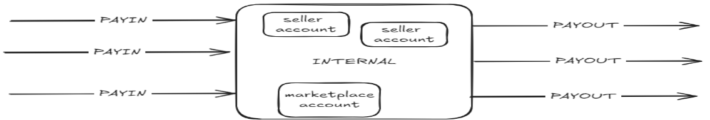

# 🚧 Marketplaces journeys

### GitBook

MODIFIER LES ENDPOINT AVEC LES VRAIS METTRE LES CODES RETOUR…

METTRE LES VRAIS WEBHOOKS

## Developer how-to guides

Follow step-by-step guides for integrating Marketplace Services flows and seller verification.

The guides include walkthroughs on testing and integrating Marketplace Services features. Refer to the related guides below:

### Glossary

* Merchant: the marketplace itself
* Seller : the company who sells products on the marketplace website.
* Contact : physical person having a relashionship direct or indirect with a seller entity. Account/Wallet : payment account of the seller or the marketplace
* PAYIN : all money flow regarding incoming cash PAYOUT : all money flow regarding outgoing cash
* INTERNAL : all money flow between marketplace and sellers accounts

***

## 1 - Marketplace onboarding

Parameters to provide:

* PayoutSeller mode EP choice

### API parameters

* Credentials Scope

## 2 - Seller on boarding and KYB[^1]

First of all, to start working with Marketplace Services, you have to integrate a set of endpoints to onboard your sellers. These endpoint are designed to support the onboarding in multiple-times without having to save any sensitive data on your side.

### Onboarding & KYB endpoints:

| 
<strong>HTTP</strong>

<strong>request</strong>
 | **Endpoint**                                     | **Usage**                                                                              |
| ----------------------------------------------------------- | ------------------------------------------------ | -------------------------------------------------------------------------------------- |
| PUT                                                         | /sellers/{merchantSellerId}                      | Start the onboarding of a seller based on your own id.                                 |
| GET                                                         | /sellers/{merchantSellerId}                      | Get all values already filled of a seller                                              |
| POST                                                        | /sellers/{merchantSellerId}/contacts             | Add a physical person on a existing seller. All effective beneficiaries must be added. |
| PATCH                                                       | /sellers/{merchantSellerId}/contacts/{contactId} | Change some informations about a contact                                               |
| DELETE                                                      | /sellers/{merchantSellerId}/contacts/{contactId} | Delete a contact                                                                       |
| POST                                                        | /sellers/{merchantSellerId}/documents            | Add a document attached to a seller (KBIS, fiscal statement, etc.)                     |

| DELETE | /sellers/{merchantSellerId}/documents/{documentId}                                   | Delete a seller document                                                                    |
| ------ | ------------------------------------------------------------------------------------ | ------------------------------------------------------------------------------------------- |
| POST   | /sellers/{merchantSellerId}/contact/{contactId}/documents                            | Add a document attached to an effective beneficiary (Id card, passport, etc.)               |
| DELETE | 
/sellers/{merchantSellerId}/contact/{contactId}/documents/{documentId

}
 | Delete a contact document                                                                   |
| POST   | /sellers/{merchantSellerId}/\_assess-kyc                                             | Start the KYB of a specific seller and all the KYC of the contacts attached to this seller. |


[endpoints-sellers-on-boarding.md](../api-reference/marketplace-services-api/uat-api-for-partners/endpoints-sellers-on-boarding.md)


### Onboarding & KYB journey

  **Objective: launch the KYB review of a seller**

#### Manage the sellers&#x20;

The solution is designed to allow the marketplace to use his own ID to manage the sellers in the scaleXpert environement.


For an existing seller, the marketplace make a KYB renewal for the seller. Some fields already known by the marketplace and could be pre-filled.



Pre-requisite to call the API endpoint

You have a solutionCode

You have the right credentials


The seller is connected to the marketplace back-office and is in the registration process. Different forms (depending your own design) allow the seller to complete required informations. Each time a new data is filled, the marketplace can use the endpoint to store the values filled.

PUT /sellers/{merchantSellerId}

If the values are not registered on the marketplace side and the seller comes some days later to add new information, the marketplace can retrieve all the previously

GET /sellers/{merchantSellerId}

#### Sequence diagram

#### - Manage the contacts&#x20;

After the seller creation, the marketplace can add all the contacts required. Here the contacts are all the direct and indirect UBO of the seller.


To know the criterias of an Ultimate Beneficiary Owner (UBO) of a company: [RBE\_Fiche\_pratique\_schemas (greffe-tc-paris.fr)](https://www.greffe-tc-paris.fr/uploads/paris/Fiches%20RCS/RBE_Fiche_pratique_schemas.pdf)


The HTTP verbs available to manage contacts are the classical POST, PATCH and DELETE with the standard rules of the rest protocol.

#### Sequence Diagram

#### - Manage the documents 

In order to process the KYB of the seller and each contacts, the marketplace must ask to the seller several documents. A document cannot be updated but only added or deleted.

 LISTER LES DOCS REQUIS MINIMUMS

The available methods allow to post as many documents as necessary on a seller and on a contact.

#### Sequence Diagram

#### - Launch the KYB of the seller 

The marketplace should allow the seller to launch the KYB process with an explicit button. As soon as the seller has filled at a minimum:

* Required fields of the seller endpoint
* One attached document One contact as minimum
* Required fields of the contact endpoint
* One document attached to the contact as minimum

The button “submit” become clickable and the seller can launch the KYB process.


Quelle erreur s’il manque des infos contact ou seller


#### Sequence diagram

As soon as the endpoint is called, the seller and all attached contacts and documents are no more updatable. THe KYC review take around 48 hours. The marketpalace should wait for the status change (webhook) to know if some changes are required or if the seller KYB is ACCEPTED.

### List of the Webhooks

note: http 422 sur un champ absent.

### Lifecycle

***

### Seller lifecycle KYB KYC downgrade

TBW

## 3 - Cash flow management journey

### Orders

#### Rules&#x20;

* Considering that the marketplace has a minimum of one seller (with KYB validated), it can start to register orders.
* Each time the marketplace register a new order, a notification must be sent to MS. Orders are the entry point of all following steps. It is required for MS to manage accounting part for proposing all value-added features.
* On the MS side, the minimum required field for an order is the amount, but some extra info could be great to provide. The amount of an order has no impact on accouning part of MS. Only **transactions amounts** are considered

#### Fields&#x20;

Main fields of an order are:

* externalOrderId - unique Marketplace identifier of the order amount - total amount of the order
* currency - currency of the order
* externalCustomerId - unique Marketplace identifier of the buyer

#### Endpoint&#x20;

| **HTTP request** | **Endpoint**      | **Usage**                                                                |
| ---------------- | ----------------- | ------------------------------------------------------------------------ |
| POST             | /orders           | Create an order on MS side                                               |
| PATCH            | /orders/{orderId} | Change an order amount                                                   |
| DELETE           | /orders/{orderId} | Delete an order. Possible only if not transaction created for this order |


[endpoints-cash-management.md](../api-reference/marketplace-services-api/uat-api-for-partners/endpoints-cash-management.md)


#### Sequence diagram for orders

#### Webhooks&#x20;

| **WebHook name** | **Trigger**                                                                                                                                                                                                                              |
| ---------------- | ---------------------------------------------------------------------------------------------------------------------------------------------------------------------------------------------------------------------------------------- |
| order.notFound   | each time a transaction refers an order that has not be created before in MS, this webhook is sent to notify the marketplace that MS doesn’t know this order. The marketplace should then make a PATCH order to update the order amount. |

### Transactions

#### **Rules**&#x20;

* All PAYIN are related/linked to a transaction
* A transaction is related to an order
* A transaction is an accountable operation A transaction can be PAID or not
* If not PAID, it will impact previsional amounts (expected amount in the futur) If PAID, funds are available for next opérations (transfers, payouts, etc.)
* A transaction can be for the benefit of the marketplace: PAYMENT or for the benefit of the buyer: REFUND and CREDIT
* A transaction is coming for a known payment method (PSP, APM, SCT, etc.)&#x20;
* A transaction can have a due date

If so, a specific webhook will be generated when the date is reached and the transaction is still not paid No limits regarding number of transactions attached to a single order

* The amount field must be > 0
* A transaction REFUND cannot be registered before a transaction PAYMENT on the same orderId.

#### Fields&#x20;

Main fields of a transaction are:

* externalOrderId - unique Marketplace identifier of the order externalTransactionId - unique Marketplace identifier of the transaction type - PAYMENT or REFUND or CREDIT
* amount - total amount of the transaction currency - currency of the transaction
* paymentMethodName - chanel used to process the transaction

#### Endpoints&#x20;

| **HTTP request** | **Endpoint**                  | **Usage**                                                                              |
| ---------------- | ----------------------------- | -------------------------------------------------------------------------------------- |
| POST             | /transactions                 | Create a transaction on MS side                                                        |
| PATCH            | /transactions/{transactionId} | Change the due date of a transaction                                                   |
| DELETE           | /transactions/{transactionId} | Delete a transaction. Possible only if sum of amount cashed for this transaction is 0€ |
| GET              | /transactions                 | Retreive all transactions from the last                                                |
| GET              | /transactions/{transactionId} | Retreive a spécific transaction                                                        |


[endpoints-cash-management.md](../api-reference/marketplace-services-api/uat-api-for-partners/endpoints-cash-management.md)


An order with several transactions

#### Webhooks&#x20;

| **WebHook name**   | **Trigger**                                                                                                                                                                                                                                                           |
| ------------------ | --------------------------------------------------------------------------------------------------------------------------------------------------------------------------------------------------------------------------------------------------------------------- |
| order.notFound     | each time a transaction refers an order that has not be created before in MS, this webhook is sent to notify the marketplace that MS doesn’t know this order. The marketplace should then make a PATCH order to update the order amount.                              |
| transaction.update | 
each time the field paidAmount of a transaction is updated, this webhook is sent to notify the markeptlace

each time the dueDate of a transaction is reached, and the paidAmount is not equals to amount, this webhook is sent to notify the markeptlace
 |

### OrderSplit

#### **Rules**&#x20;

* An orderSplit create an INTERNAL movment of funds
* An orderSplit is used to dispatch amounts from transactions it can be called one time or many time.
* Each new call (for the same ORDER) is cumulative with previous calls.
* An orderSplit realize a fund movement as described in the schema:

#### SequenceDiagram

If the transactions are not cashed (money is not settled), these operations between CANTONMENT account and SELLERS accounts are stored as previsional.

It is not possible to split an amount GREATER than the cumulated amount of transactions transactions can be PAID or not, it doesn’t affect the result

In a logic way, at the end of the day (when the full order is sent), the full amount of transactions must be splitted.

If a refund occurs, the orderSplit can be used to call back the money of a seller and to give back marketplace fees to this seller.

#### SequenceDiagram

#### Fields&#x20;

Main fields of an orderSplit are:

* externalOrderId - unique Marketplace identifier of the order sellerId - unique seller identifier
* amount - amount to exchange with the seller for this order
* amountType - SELLER\_PAYMENT to pay the seller, SELLER\_REFUND to take back amount from the seller fee - amount of fees of the marketplace
* feeType - used to precise is fees are from the seller to the marketplace or the opposite currency - currency of the split

model - say if the seller is in a 2P or a 3P model for this specific order

#### Endpoint&#x20;

| **HTTP request** | **Endpoint** | **Usage**                                             |
| ---------------- | ------------ | ----------------------------------------------------- |
| POST             | /orderSplit  | To dispatch PAYINS of an order into sellers accounts. |


[endpoints-cash-management.md](../api-reference/marketplace-services-api/uat-api-for-partners/endpoints-cash-management.md)


**Webhook**&#x20;

There is no webhook regarding splits. A split is refused or accepted but has no specific status.

### Transfers

#### Rules&#x20;

* A transfer create an INTERNAL movment of funds
* A transfer is always between the marketplace main account and a seller account It can be from marketplace to selle or from seller to marketplace

#### Fields&#x20;

Main fields of a transfer are:

* accountingEntry - the way of funds
* reasonCode - used to explicit the reason of the transfer usage amount - amount to transfer
* sellerId - seller to deal with

#### Endpoint&#x20;

| **HTTP request** | **Endpoint**             | **Usage**                                                                                           |
| ---------------- | ------------------------ | --------------------------------------------------------------------------------------------------- |
| POST             | /transfers               | To move money between marketplace and seller                                                        |
| DELETE           | /transfers/{transferId}  | Delete a transfer. Possible only if the transfer is still not executed (planified in a future date) |
| GET              | /transfers               | Retreive all transfers from the last                                                                |
| GET              | /transfers/{transferId } | Retreive a specific transfer                                                                        |


[endpoints-cash-management.md](../api-reference/marketplace-services-api/uat-api-for-partners/endpoints-cash-management.md)


#### **Webhook**&#x20;

| **WebHook name** | **Trigger**                                                                                                                                                                     |
| ---------------- | ------------------------------------------------------------------------------------------------------------------------------------------------------------------------------- |
| transfer.update  | a transfer is immediately executed but some controls are done asynchronously. That’s why there is a webhook to give the definitive status of a transfer: VALIDATED or CANCELLED |

|   | If executionDate is used, the webhook will be sent a the day of the execution. |
| - | ------------------------------------------------------------------------------ |

### PayoutMerchants

#### **Rules**&#x20;

* A payoutMerchant create an EXTERNAL movment of funds
* A payoutMerchant is used to send an amount to the beneficiary IBAN declared by the marketplace it can be called one time or many time.
* Each new call is a new wire SCT (Sepa Credit Transfer)

#### Fields&#x20;

Main fields of a PayoutMerchant are:

* reasonLabel - text that will appear on the bank account of the receiver of funds amount - amount to send out

#### Endpoint&#x20;

| **HTTP request** | **Endpoint**                          | **Usage**                                                                                               |
| ---------------- | ------------------------------------- | ------------------------------------------------------------------------------------------------------- |
| POST             | /payoutMerchants                      | To send money to merchant external bank account                                                         |
| DELETE           | /payoutMerchants/{payoutMe rchantsId} | Delete a payoutMerchant. Possible only if the payout is still not executed (planified in a future date) |
| GET              | /payoutMerchants                      | Retreive all payoutMerchants from the last                                                              |
| GET              | /payoutMerchants/{payoutMe rchantsId} | Retreive a specific payoutMerchants                                                                     |


[endpoints-cash-management.md](../api-reference/marketplace-services-api/uat-api-for-partners/endpoints-cash-management.md)


#### **Webhook**&#x20;

| **WebHook name**      | **Trigger**                                                                                                                                                                                                               |
| --------------------- | ------------------------------------------------------------------------------------------------------------------------------------------------------------------------------------------------------------------------- |
| payoutMerchant.update | a payout is never immediately executed. It is linked to banks batchs. When the payout will be realized, this webhook will be send to notify that the status is now VALIDATED or CANCELLED (if not enough funds available) |

### PayoutSellers

#### **Rules**&#x20;

* A payoutSeller create an EXTERNAL movment of funds
* A payoutSeller is used to send an amount to the beneficiary IBAN declared by the seller it can be called one time or many time.
* Each new call generates a new wire SCT (Sepa Credit Transfer)
* In case of the previsional amount is negative, sometimes there is no wire generated There is 3 ways to use the payoutSeller:
  * externalOrderId
  * With order ids: list of
  * With oder ids and specific
  * askedAmount
* provided will be paid as much as possible (depending received funds) to pay an order partially
* With just the sellerId to pay all orders that are payable (funds received)
* A payoutSeller can include also a list of transfers to be paid (transfers received by the seller)

#### Fields&#x20;

Main fields of a payoutSeller are:

* reasonLabel - text that will appear on the bank account of the receiver of funds transfers- table of externalTransferId to be paid
* orders- table of externalOrderId to be paid (and askedAmount if partial payment)

#### Endpoint&#x20;

| **HTTP request** | **Endpoint**                                        | **Usage**                                                                                             |
| ---------------- | --------------------------------------------------- | ----------------------------------------------------------------------------------------------------- |
| POST             | /sellers/{sellerId}/payoutSellers                   | To send money to seller external bank account                                                         |
| DELETE           | /sellers/{sellerId}/payoutSellers/{payoutSellersId} | Delete a payoutSeller. Possible only if the payout is still not executed (planified in a future date) |
| GET              | /sellers/{sellerId}/payoutSellers                   | Retreive all payoutSellers from the last                                                              |
| GET              | /sellers/{sellerId}/payoutSellers/{payoutSellersId} | Retreive a specific payoutSellers                                                                     |


[endpoints-cash-management.md](../api-reference/marketplace-services-api/uat-api-for-partners/endpoints-cash-management.md)


#### **Webhook**&#x20;

| **WebHook name**    | **Trigger**                                                                                                                                                                                                               |
| ------------------- | ------------------------------------------------------------------------------------------------------------------------------------------------------------------------------------------------------------------------- |
| payoutSeller.update | a payout is never immediately executed. It is linked to banks batchs. When the payout will be realized, this webhook will be send to notify that the status is now VALIDATED or CANCELLED (if not enough funds available) |

### PayoutSellerAmount

#### **Rules**&#x20;

* A PayoutSellerAmount create an EXTERNAL movment of funds
* A PayoutSellerAmount is used to send an amount to the beneficiary IBAN declared by the seller it can be called one time or many time.
* Each new call generates a new wire SCT (Sepa Credit Transfer)
* PayoutSellerAmount is like the payoutSeller but based on a requested amount it disable the feature regarding fund control on an order level
* funds are only controlled on a seller level
* finally, in this mode, the marketplace is responsible to manage the reporting to his seller regarding which order is paid or not

#### Fields&#x20;

Main fields of a PayoutMerchant are:

* reasonLabel - text that will appear on the bank account of the receiver of funds askedAmount - amount to send out

#### Endpoint&#x20;

| **HTTP request** | **Endpoint**                           | **Usage**                                     |
| ---------------- | -------------------------------------- | --------------------------------------------- |
| POST             | /sellers/{sellerId}/payoutSellerAmount | To send money to seller external bank account |

| DELETE | /sellers/{sellerId}/payoutSellerAmount/{payoutSellerAmountId} | Delete a payoutSellerAmount. Possible only if the payout is still not executed (planified in a future date) |
| ------ | ------------------------------------------------------------- | ----------------------------------------------------------------------------------------------------------- |
| GET    | /sellers/{sellerId}/payoutSellerAmount                        | Retreive all payoutSellerAmountfrom the last                                                                |
| GET    | /sellers/{sellerId}/payoutSellerAmount/{payoutSellerAmountId} | Retreive a specific payoutSellerAmount                                                                      |


[endpoints-cash-management.md](../api-reference/marketplace-services-api/uat-api-for-partners/endpoints-cash-management.md)


#### **Webhook**&#x20;

| **WebHook name**    | **Trigger**                                                                                                                                                                                                               |
| ------------------- | ------------------------------------------------------------------------------------------------------------------------------------------------------------------------------------------------------------------------- |
| payoutSeller.update | a payout is never immediately executed. It is linked to banks batchs. When the payout will be realized, this webhook will be send to notify that the status is now VALIDATED or CANCELLED (if not enough funds available) |

## 4 - Go live

Cahier de recette avant de passer en production

[^1]: Know Your Business
