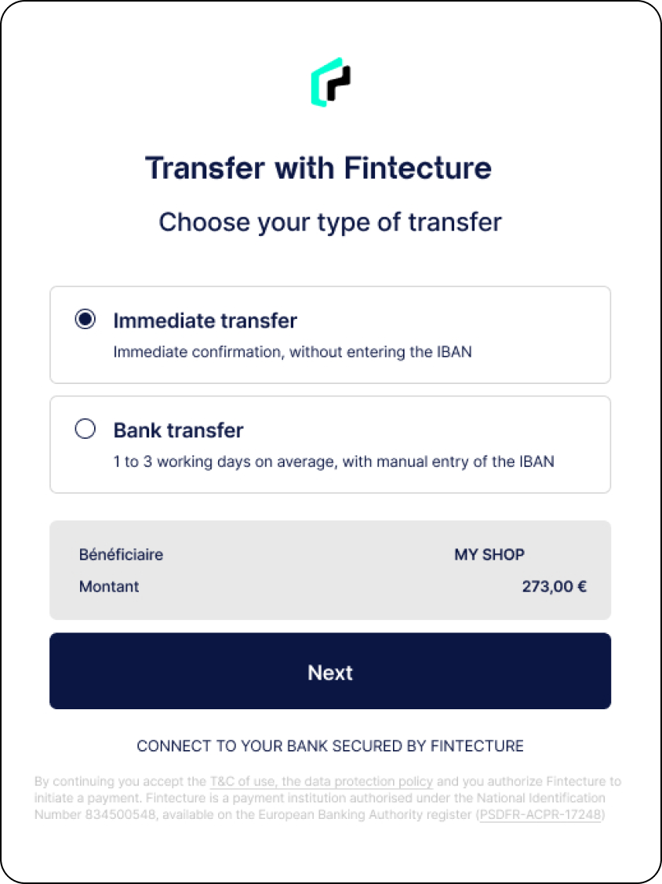

# 🚧 Immediate payment (Fintecture)

## Boost your performance with the Immediate Transfer


This feature is provided directly by our partner Fintecture.


<table data-header-hidden><thead><tr><th width="443"></th><th></th></tr></thead><tbody><tr><td>
An Immediate Transfer (a.k.a PayByBank ) is an Account-to-Account (A2A) immediate and irrevocable credit transfer paid from a payer's bank account directly to a merchants bank account. To simplify the process and to create a seamless payment experience, the payer is redirected to a payment interface called Connect from where he can choose his bank and go through the payment process. 

 
</td><td></td></tr></tbody></table>


Read Fintecture documentation

