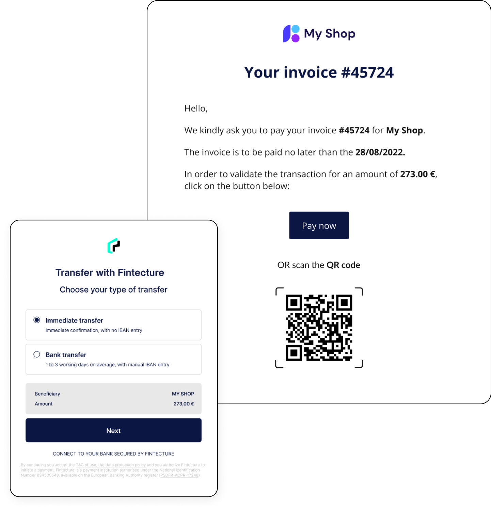

# 🚧 Request To Pay (Fintecture)

## Send out payment requests hassle free with the Request To Pay


This feature is provided directly by our partner Fintecture.


<table data-header-hidden><thead><tr><th width="391"></th><th></th></tr></thead><tbody><tr><td>
Send a payment request by email, link, SMS or QR code and receive funds directly into your account.

 

Follow the guides to seamlessly integrate.
</td><td></td></tr></tbody></table>


Read Fintecture documentation

