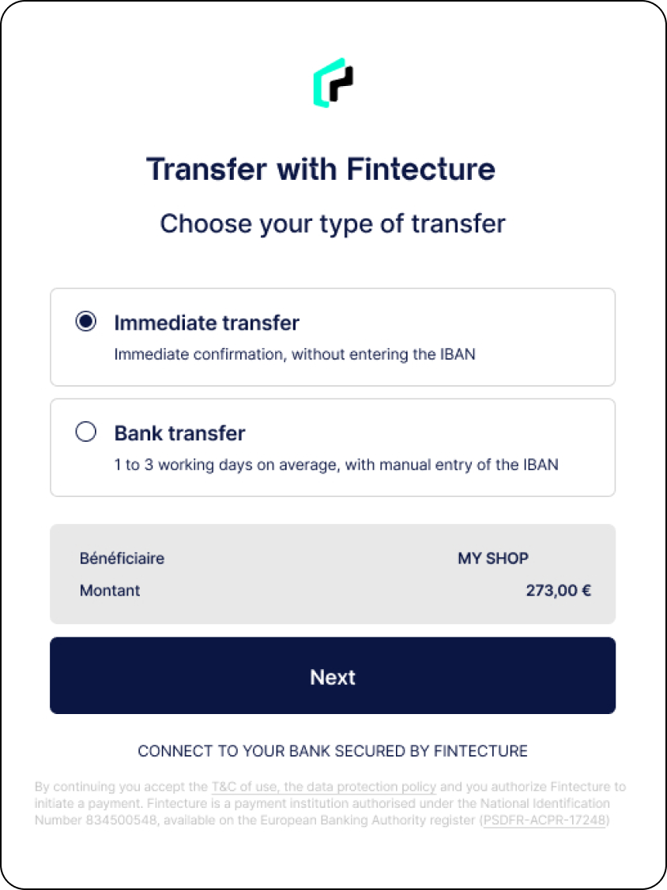

# 🚧 Smart Transfer (Fintecture)

## Boost your performance with the Smart Transfer


This feature is provided directly by our partner Fintecture.


<table data-header-hidden><thead><tr><th width="443"></th><th></th></tr></thead><tbody><tr><td>
Collect 100% of your transfers quickly and simply.

 

Follow the guides to seamlessly integrate.

 
</td><td></td></tr></tbody></table>


Read Fintecture documentation

