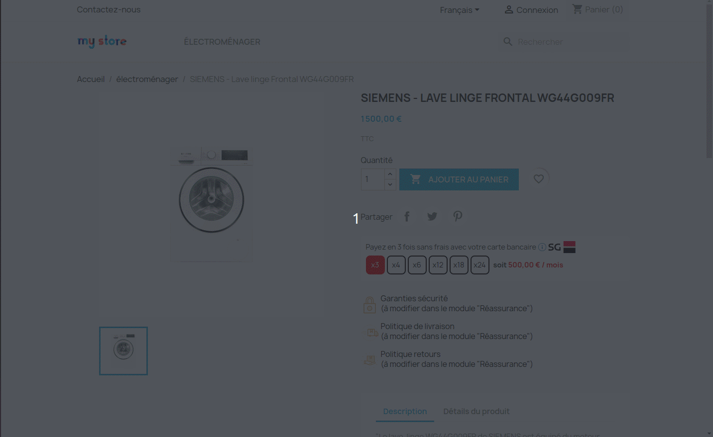
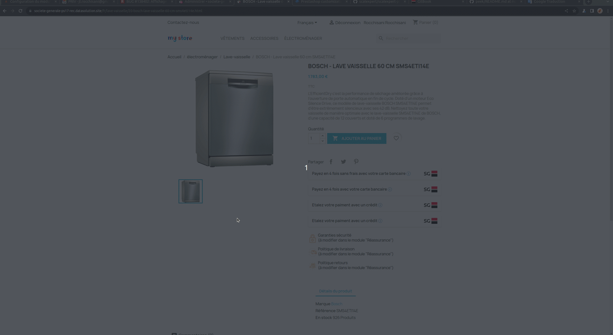
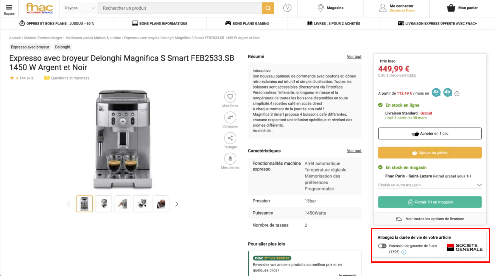
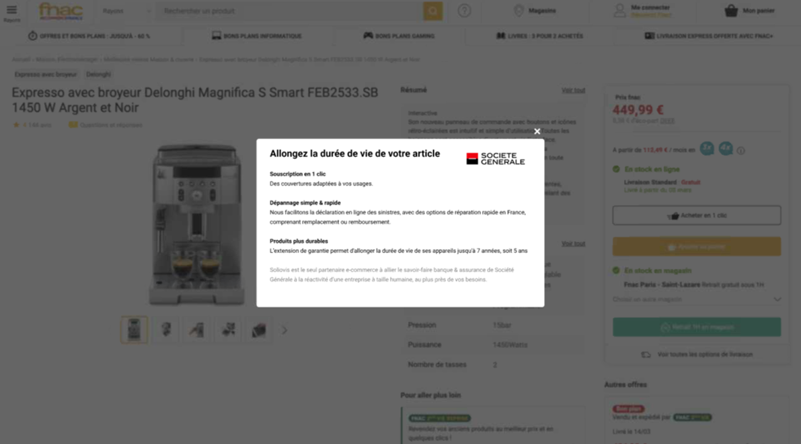
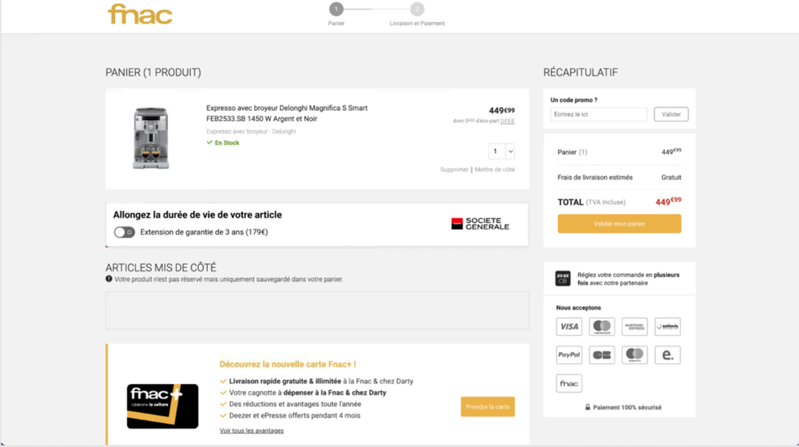

# Showcasing solutions

## Showcasing the credit offers on your website

In order to bring your customer's attention to the credit offer, through the Product and services API , you will be able to showcase the different eligible offers :&#x20;

On your **product page**, depending on the eligibility of the product's price, you will be able to display the relevant offers, right next to the price. You can of course customize the display by selecting the optional components that you wish to integrate, such as logo, text, urls ...&#x20;

See more details how to render a solution [here](../integration-guides/integrations-modes/direct/#step-2-showcasing-the-solutions).

<figure><figcaption>
How to showcase solution on product page
</figcaption></figure>

Furthermore, on your **checkout page**, if the basket amount is eligible to a credit offer, which will be determined by the Product & services API, you will be able to display the credit payment method (see below) as well as an explanation of the installments _(split payment only)_&#x20;

<figure><figcaption>
How to showcase solution on check-out page
</figcaption></figure>

## Showcasing insurance offers on your website

In order to bring your customer's attention to the insurance offer, through the Product and services API and the item Eligibility , you will be able to showcase the different eligible offers :&#x20;

On your **product page**, depending on the eligibility of the product's price and category, you will be able to display the relevant offers in its own section, directly on the product page. You can of course customize the display by selecting the optional components that you wish to integrate, such as the logo. Here is below an example of the insertion of all the components put at your disposal : &#x20;

<figure><figcaption></figcaption></figure>

Upon clicking, your client can access further information on the insurance products as well as pre-contractual documents for which the link will also be provided yo you via our Product & services API.

<figure><figcaption></figcaption></figure>

It is recommended to insert an intermediary page to push to client who haven't selected an insurance offer yet as it makes it more visible and can get overall better sales, the information needed will also be provided through the Product & services API and the eligibility API :&#x20;

<figure><figcaption></figcaption></figure>

Furthermore, on your **checkout page**, if there are eligible products and your client still hasn't picked an insurance offer, you will be able to display the offer once again :&#x20;

<figure><figcaption></figcaption></figure>

