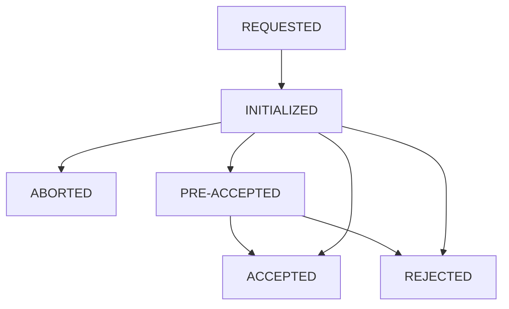

# E-financing Status life cycle

### Statuses  definition:

* REQUESTED: Subscription requested to financial institution&#x20;
* INITIALIZED: Subscription has been initialized by financial institution
* PRE\_ACCEPTED: Subscription pre-accepted pending KYC, contrat signature and final acceptation by financial institution
* ACCEPTED: Subscription accepted by financial institution
* REJECTED: subscription rejected by financial institution
* ABORTED: subscription has been aborted due to technical incident or user abort
* CANCELLED: subcription cancelled by financial institution&#x20;

### Status life cycle:

<figure><figcaption>
E-financing subscription status life cycle
</figcaption></figure>

